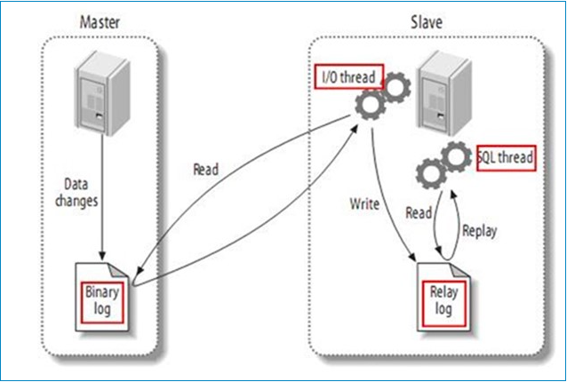

# MySQL 双主配置

## 一、主从配置原理

1. master将改变记录到二进制日志(binary log)中（这些记录叫做二进制日志事件，binary log events）；

2. slave将master的binary log events拷贝到它的中继日志(relay log)；

3. slave重做中继日志中的事件，将改变反映它自己的数据。

   

   

   ​		如上图所示，要实现数据同步，第一步就是要开启binlog。MySQL将事务串行的写入二进制日志，即使事务中的语句都是交叉执行的。在事件写入二进制日志完成后，master通知存储引擎提交事务。

   ​		下一步就是slave将master的binary log拷贝到它自己的中继日志。首先，slave开始一个工作线程——I/O线程。**I/O线程**在master上打开一个普通的连接，然后开始binlog dump process。Binlog dump process从master的二进制日志中读取事件，如果已经跟上master，它会睡眠并等待master产生新的事件。I/O线程将这些事件写入中继日志。

   ​		SQL slave thread从中继日志中读取事件，更新slave的数据，使其与master中的数据一致。


**配置文件如下：**

```shell
# cat /etc/my.cnf
[mysqld]
# 同步环境中表示服务器
server-id=3
# 开启binlog
log-bin=mysql-bin
# 来控制数据库的binlog刷到磁盘上去，1性能消耗最大，表示每次commit都提交一次
# 0表示由文件系统自己控制它的缓存的刷新
# 对于高并发事务的系统来说，“sync_binlog”设置为0和设置为1的系统写入性能差距可能高达5倍甚至更多。
sync_binlog=1
binlog_checksum=none
binlog_format=mixed
#每次自增2(否则会默认自增1)
auto-increment-increment=2

# 起始ID。为保证同步过程中id不发生冲突，每台配置要不相同
auto-increment-offset=1
slave-skip-errors=all

# 忽略不同步的数据库
binlog-ignore-db = mysql
binlog_ignore_db = information_schema
binlog_ignore_db = performation_schema
binlog_ignore_db = sys
log-error=/var/log/mysqld.log
pid-file=/var/run/mysqld/mysqld.pid

# 最大连接数
max_connections=2000
```


## 二、配置流程

sql语句：

1. 给对端数据库创建一个账号用户同步

   > GRANT REPLICATION SLAVE,RELOAD,SUPER ON *.*  TO sync@'masterip' IDENTIFIED BY 'sync@Mysql123'; 

2. 写入主库的相关配置

   > CHANGE MASTER TO MASTER_HOST='masterip',MASTER_USER='sync',MASTER_PASSWORD='sync@Mysql123',MASTER_LOG_FILE='log_file',MASTER_LOG_POS=log_pos;

3. 检查binlog偏移

   > show master status;

4. 检查同步状态

   > show slave status;

```bash
#!/bin/bash

# 使用示例：
# ./mysqlSync.sh check_binlog # 检查是否开启binlog
# ./mysqlSync.sh relieve =》解除本机的数据同步关系。（双向解除同步关系，需要两台机器上都执行此脚本）
# ./mysqlSync.sh 192.168.201.188 192.168.201.189 1   =》建立同步关系，数据从189同步到188，
# ./mysqlSync.sh 192.168.201.189 192.168.201.188 2   =》建立同步关系，数据从188同步到189，
# ./mysqlSync.sh 192.168.201.188 192.168.201.189 health_check =》双主关系健康检查

LOCAL_IP=$1
MASTER_IP=$2
offset=$3

WORKDIR="/tmp"        
CONN_STR="/usr/bin/mysql -uroot -pyamu@Mysql123"
LOG=/var/log/mysql_sync.log

log() {
    echo `date` : $1 >> $LOG
	echo `date` : $1
}

write_binlog_conf() {
	cat > /etc/my.cnf <<EOF
[mysqld]
server-id=3
log-bin=mysql-bin
sync_binlog=1
binlog_checksum=none
binlog_format=mixed
auto-increment-increment=2
auto-increment-offset=1
slave-skip-errors=all
binlog-ignore-db = mysql
binlog_ignore_db = information_schema
binlog_ignore_db = performation_schema
binlog_ignore_db = sys
log-error=/var/log/mysqld.log
pid-file=/var/run/mysqld/mysqld.pid
max_connections=2000
EOF
}

checkBinlog() {
	grep -q "log-bin" /etc/my.cnf
	if [ $? -ne 0 ]; then
		log "file not exist: /etc/my.cnf"
		log "create: /etc/my.cnf"
		write_binlog_conf
	fi
	systemctl restart mysqld
}

checkDefaultSql()
{
	if [ ! -f $WORKDIR/2master-defaul.sql ];then
		log "file not exist: $WORKDIR/2master-default.sql"
		log "create: $WORKDIR/2master-default.sql"
        cat > $WORKDIR/2master-defaul.sql <<EOF
GRANT REPLICATION SLAVE,RELOAD,SUPER ON *.*  TO sync@'masterip' IDENTIFIED BY 'sync@Mysql123'; 
CHANGE MASTER TO MASTER_HOST='masterip',MASTER_USER='sync',MASTER_PASSWORD='sync@Mysql123',MASTER_LOG_FILE='log_file',MASTER_LOG_POS=log_pos;
start slave;
flush privileges;
EOF
        log "created file done"
    fi
}

relieve() {
	write_binlog_conf
	$CONN_STR -e "stop slave;reset slave all;"
	systemctl restart mysqld
	log "relieve success"
}

changeId()
{
	log "modify server-id/offset on $IP2 and restart mysql:"
    #修改server-id/offset 为 $3 并重启数据库
    sed -i "s/^server-id.*$/server-id = $1/g" /etc/my.cnf
    sed -i "s/^auto-increment-offset.*$/auto-increment-offset = $1/g" /etc/my.cnf
	systemctl restart mysqld
	[[ $? -eq 0 ]] || exit 1
}

configMaster() {
	LOCAL_IP=$1
	MASTER_IP=$2
	#获取master status的状态值
	$CONN_STR -h $MASTER_IP -e "flush tables with read lock;"
    status_a=`$CONN_STR -h $MASTER_IP -e "show master status" | sed '1d'`
	#[[ ! -n "$status_a" ]] && exit 1
	$CONN_STR -h $MASTER_IP -e "unlock tables;"

	#获取log_file
	log_file=`echo ${status_a} | awk '{print $1}'`
	#获取log_pos	
	log_pos=`echo ${status_a} | awk '{print $2}'`
	log "Generating master config file..."
	cp $WORKDIR/2master-defaul.sql $WORKDIR/2master-$LOCAL_IP.sql
	#替换的sql中masterip,log_file,log_pos为真实值
    sed -i -e "s/masterip/$MASTER_IP/g" -e "s/log_file/$log_file/g" -e "s/log_pos/$log_pos/g" $WORKDIR/2master-$LOCAL_IP.sql
	log "configing master and privileges on $1..."
	#向mysql注入配置命令
    $CONN_STR -h $LOCAL_IP < $WORKDIR/2master-$LOCAL_IP.sql
	if [ $? -eq 0 ];then
		log "config on mysql sync success" 
	else
		log "config on mysql sync fail"
		exit 1
	fi
}

checkSlaveStatus()
{
	ip1_s=`$CONN_STR -h $LOCAL_IP -e "show slave status\G;" | grep "Slave_IO_Running"`
	ip2_s=`$CONN_STR -h $MASTER_IP -e "show slave status\G;" | grep "Slave_IO_Running"`
	log "[health_check] $IP1 $ip1_s"
	log "[health_check] $IP2 $ip2_s"
	if [[ "$ip1_s" =~ "Yes" ]] && [[ "$ip2_s" =~ "Yes" ]]; then
		log "2master between $IP1 and $IP2 is running now, exist"
		exit 0
	else
		log "2master between $IP1 and $IP2 is not runing..."
	fi
}

#step1. 对参数进行校验
if [ "$1" == "relieve" ]; then
	relieve
	exit 0
fi

# 双主模式需要binlog支持
if [ "$1" == "check_binlog" ]; then
	checkBinlog
	exit 0
fi

# 检查双主状态，若已建立，退出
checkSlaveStatus
if [ "$3" == "health_check" ]; then
    exit 0
fi

# service-id 必须为数字
if [ "$3" -gt 0 ] 2>/dev/null; then
	log "service-id is $3"
else 
	log "service-id is not num: $3, exit"
	exit 1
fi

# step2. 配置双主模式的sql语句
checkDefaultSql
# step3. 双主模式需要配置server-id
changeId $3
# step4. 配置$1为slave，从$2同步数据到$1
configMaster $1 $2

```


## 三、附录

sql同步相关命令

1. 是否启用了日志：show variables like 'log_bin';
2. 获取binlog文件列表：show binary logs;
3. 查看当前正在写入的binlog日志：show master status；
4. 查看指定binlog文件的内容：show binlog events in 'mysql-bin.000002';
5. 