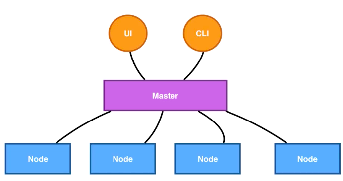

# k8s核心概念

## 一、什么是Kubernetes

**kubernetes 要解决什么问题？**

* 工业级的容器编排平台
* 自动化的容器编排平台呢，负责应用的部署、弹性和管理。
* 核心功能：
  * 服务发现与负责均衡
  * 容器自动装箱（调度）
  * 存储编排
  * 自动容器恢复
  * 自动发布与回滚
  * 配置与密文管理
  * 批量执行Jod任务
  * 水平伸缩

## 二、kubernetes 的架构

​		Kubernetes 架构是一个比较典型的二层架构和 server-client 架构。Master 作为中央的管控节点，会去与作为计算节点的 Node 进行一个连接。所有 UI 的、clients、这些 user 侧的组件，只会和 Master 进行连接，把希望的状态或者想执行的命令下发给 Master，Master 会把这些命令或者状态下发给相应的节点，进行最终的执行。

​		

**Master节点架构**

Kubernetes 的 Master 包含四个主要的组件：API Server、Controller、Scheduler 以及 etcd。如下图所示：

* **API Server：**`kube-apiserver`，顾名思义是用来处理 API 操作的，Kubernetes 中所有的组件都会和 API Server 进行连接，组件与组件之间一般不进行独立的连接，都依赖于 API Server 进行消息的传送；
* **Controller：**`kube-controller-manager`，是控制器，它用来完成对集群状态的一些管理和容器编排。比如自动对容器进行修复、自动进行水平扩张，都是由 Kubernetes 中的 Controller 来进行完成的；
* **Scheduler：**`kube-scheduler`，是调度器，“调度器”顾名思义就是完成调度的操作，例如把一个用户提交的 Container，依据它对 CPU、对 memory 请求大小，找一台合适的节点，进行放置；
* **etcd：**是一个分布式的一个存储系统，API Server 中所需要的这些原信息都被放置在 etcd 中，etcd 本身是一个高可用系统，通过 etcd 保证整个 Kubernetes 的 Master 组件的高可用性。

**Node节点架构**

​		Kubernetes 的 Node 是真正运行业务负载的，每个业务负载会以 Pod 的形式运行。一个 Pod 中运行的一个或者多个容器，真正去运行这些 Pod 的组件的是叫做 **kubelet**，也就是 Node 上最为关键的组件，**它通过 API Server 接收到所需要 Pod 运行的状态，同容器运行时（比如Docker项目）进行交互**。而这个交互所依赖的，是一个称作**CRI（Container Runtime Interface）**的远程调用接口，这个接口定义了容器运行时的各项核心操作，比如：启动一个容器需要的所有参数。

​		*正因为如此，Kubernetes 项目并不关心你部署的是什么容器运行时、使用的什么技术实现，只要你的这个容器运行时能够运行标准的容器镜像，它就可以通过实现 CRI 接入到 Kubernetes 项目当中。*

​		*而具体的容器运行时，比如 Docker 项目，则一般通过 OCI 这个容器运行时规范同底层的 Linux 操作系统进行交互，即：把 CRI 请求翻译成对 Linux 操作系统的调用（操作 Linux Namespace 和 Cgroups 等）。*

​		Kubernetes 并不会直接进行网络存储的操作，他们会靠 Storage Plugin 或者是网络的 Plugin 来进行操作。用户自己或者云厂商都会去写相应的 **Storage Plugin** 或者 **Network Plugin**，去完成存储操作或网络操作。

**各组件interaction的示例**

​		

* 用户可以通过 UI 或者 CLI 提交一个 Pod 给 Kubernetes 进行部署，这个 Pod 请求首先会通过 CLI 或者 UI 提交给 Kubernetes API Server
*  API Server 会把这个信息写入到它的存储系统 etcd中
* Scheduler 会通过 API Server 的 watch 或者叫做 notification 机制得到这个信息：有一个 Pod 需要被调度。
* Scheduler 会根据它的内存状态进行一次调度决策，在完成这次调度之后，它会向 API Server report 说：“OK！这个 Pod 需要被调度到某一个节点上。”
*  API Server 接收到这次操作之后，会把这次的结果再次写到 etcd 中，然后 API Server 会通知相应的节点进行这次 Pod 真正的执行启动。
* 相应节点的 kubelet 会得到这个通知，kubelet 就会去调 Container runtime 来真正去启动配置这个容器和这个容器的运行环境，去调度 Storage Plugin 来去配置存储，network Plugin 去配置网络。

## 三、Kubernetes的核心概念与API

#### Pod

* Pod 是 Kubernetes 的一个**最小调度以及资源单元**。
* 用户可以通过 Kubernetes 的 Pod API 生产一个 Pod，让 Kubernetes 对这个 Pod 进行调度，也就是把它放在某一个 Kubernetes 管理的节点上运行起来。
* 一个 Pod 简单来说是对一组容器的抽象，它里面会**包含一个或多个容器**。

* 在 Pod 里面，也可以去**定义容器所需要运行的方式**。比如说运行容器的 Command，以及运行容器的环境变量等等。
* Pod 这个抽象也给这些容器提供了一个**共享的运行环境**，它们会共享同一个网络环境，这些容器可以用 localhost 来进行直接的连接。而 Pod 与 Pod 之间，是互相有 isolation 隔离的。

#### Volumes

​		Volume 就是卷的概念，它是用来管理 Kubernetes 存储的，是用来声明在 Pod 中的容器可以访问文件目录的，一个卷可以被挂载在 Pod 中一个或者多个容器的指定路径下面。

​		Volume 本身是一个抽象的概念，一个 Volume 可以去支持多种的后端的存储。它可以支持本地的存储，可以支持分布式的存储，还有云存储等等

#### Deployment

​		Deployment 是在 Pod 这个抽象上更为上层的一个抽象，它可以定义一组 Pod 的副本数目、以及这个 Pod 的版本。一般大家用 Deployment 这个抽象来做应用的真正的管理，而 Pod 是组成 Deployment 最小的单元。

​		Kubernetes 是通过 Controller 去维护 Deployment 中 Pod 的数目，它也会去帮助 Deployment 自动恢复失败的 Pod。

#### Service

​		一个 Deployment 可能有两个甚至更多个完全相同的 Pod。对于一个外部的用户来讲，访问哪个 Pod 其实都是一样的，所以它希望做一次负载均衡，在做负载均衡的同时，我只想访问某一个固定的 VIP，也就是 Virtual IP 地址，而不希望得知每一个具体的 Pod 的 IP 地址。

​		Service 提供了一个或者多个 Pod 实例的稳定访问地址。把所有 Pod 的访问能力抽象成一个第三方的一个 IP 地址，实现这个的 Kubernetes 的抽象就叫 Service。

#### Namespace

​		Namespace 是用来做一个集群内部的逻辑隔离的，它包括鉴权、资源管理等。Kubernetes 的每个资源，比如 Pod、Deployment、Service 都属于一个 Namespace，同一个 Namespace 中的资源需要命名的唯一性，不同的 Namespace 中的资源可以重名。

#### Kubernetes API

​		Kubernetes API 是由 **HTTP+JSON** 组成的：用户访问的方式是 HTTP，访问的 API 中 content 的内容是 JSON 格式的。

​		Kubernetes 的 kubectl 也就是 command tool，Kubernetes UI，或者有时候用 curl，直接与 Kubernetes 进行沟通，都是使用 HTTP + JSON 这种形式。

​		获取pod资源示例：

​		

		> 去提交一个 Pod，或者 get 一个 Pod 的时候，它的 content 内容都是用 JSON 或者是 YAML 表达的。上图中有个 yaml 的例子，在这个 yaml file 中，对 Pod 资源的描述也分为几个部分：
		>
		> * api version：apiVersion
		>
		> * 操作的资源：kind
		>
		> * 元数据：metadata
		>
		>   * name
		>
		>   * labels，标签，可以是一组 KeyValuePair。
		>
		>     >  label 是可以被 selector，也就是选择器所查询的。这个能力实际上跟我们的 sql 类型的 select 语句是非常相似的。通过 label，kubernetes 的 API 层就可以对这些资源进行一个筛选，那这些筛选也是 kubernetes 对资源的集合所表达默认的一种方式。
		>
		>   * annotation，对资源的额外的一些用户层次的描述。
		>
		> * 希望达到的预期状态：spec
		>
		>   > Spec 也就是我们希望 Pod 达到的一个预期的状态。比如说它内部需要有哪些 container 被运行；比如说这里面有一个 nginx 的 container，它的 image 是什么？它暴露的 port 是什么？