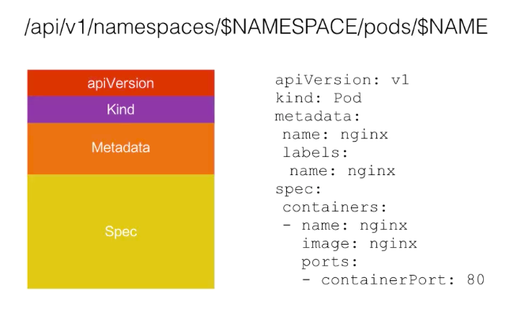

#  k8s 基础

## 一、什么是Kubernetes

	1. Kubernetes是一个开源系统，用于跨多个主机管理容器化的应用程序。 它提供了用于部署，维护和扩展应用程序的基本机制。
 	2. ​	

## 二、kubernetes 的架构

​		Kubernetes 架构是一个比较典型的二层架构和 server-client 架构。Master 作为中央的管控节点，会去与作为计算节点的 Node 进行一个连接。所有 UI 的、clients、这些 user 侧的组件，只会和 Master 进行连接，把希望的状态或者想执行的命令下发给 Master，Master 会把这些命令或者状态下发给相应的节点，进行最终的执行。

​		

详细图如下：


### 2.1 Master节点架构

Kubernetes 的 Master 包含四个主要的组件：API Server、Controller、Scheduler 以及 etcd。

* **API Server：**`kube-apiserver`，顾名思义是用来处理 API 操作的，Kubernetes 中所有的组件都会和 API Server 进行连接，组件与组件之间一般不进行独立的连接，都依赖于 API Server 进行消息的传送；
* **Controller：**`kube-controller-manager`，是控制器，它用来完成对集群状态的一些管理和容器编排。比如自动对容器进行修复、自动进行水平扩张，都是由 Kubernetes 中的 Controller 来进行完成的；
* **Scheduler：**`kube-scheduler`，是调度器，“调度器”顾名思义就是完成调度的操作，例如把一个用户提交的 Container，依据它对 CPU、对 memory 请求大小，找一台合适的节点，进行放置；
* **etcd：**是一个分布式的一个存储系统，API Server 中所需要的这些原信息都被放置在 etcd 中，etcd 本身是一个高可用系统，通过 etcd 保证整个 Kubernetes 的 Master 组件的高可用性。

### 2.2 Node节点架构

​		Kubernetes 的 Node 是真正运行业务负载的，每个业务负载会以 Pod 的形式运行。一个 Pod 中运行的一个或者多个容器，真正去运行这些 Pod 的组件的是叫做 **kubelet**，也就是 Node 上最为关键的组件，**它通过 API Server 接收到所需要 Pod 运行的状态，同容器运行时（比如Docker项目）进行交互**。而这个交互所依赖的，是一个称作**CRI（Container Runtime Interface）**的远程调用接口，这个接口定义了容器运行时的各项核心操作，比如：启动一个容器需要的所有参数。

​		*正因为如此，Kubernetes 项目并不关心你部署的是什么容器运行时、使用的什么技术实现，只要你的这个容器运行时能够运行标准的容器镜像，它就可以通过实现 CRI 接入到 Kubernetes 项目当中。*

​		*而具体的容器运行时，比如 Docker 项目，则一般通过 OCI 这个容器运行时规范同底层的 Linux 操作系统进行交互，即：把 CRI 请求翻译成对 Linux 操作系统的调用（操作 Linux Namespace 和 Cgroups 等）。*

​		kubelet 的另一个重要功能，**则是调用网络插件和存储插件为容器配置网络和持久化存储**。Kubernetes 并不会直接进行网络和存储的操作，他们会靠 Storage Plugin 或者是网络的 Plugin 来进行操作。用户自己或者云厂商都会去写相应的 **Storage Plugin** 或者 **Network Plugin**，去完成存储操作或网络操作。

**各组件interaction的示例**

​		

* 用户可以通过 UI 或者 CLI 提交一个 Pod 给 Kubernetes 进行部署，这个 Pod 请求首先会通过 CLI 或者 UI 提交给 Kubernetes API Server
*  API Server 会把这个信息写入到它的存储系统 etcd中
* Scheduler 会通过 API Server 的 watch 或者叫做 notification 机制得到这个信息：有一个 Pod 需要被调度。
* Scheduler 会根据它的内存状态进行一次调度决策，在完成这次调度之后，它会向 API Server report 说：“OK！这个 Pod 需要被调度到某一个节点上。”
*  API Server 接收到这次操作之后，会把这次的结果再次写到 etcd 中，然后 API Server 会通知相应的节点进行这次 Pod 真正的执行启动。
* 相应节点的 kubelet 会得到这个通知，kubelet 就会去调 Container runtime 来真正去启动配置这个容器和这个容器的运行环境，去调度 Storage Plugin 来去配置存储，network Plugin 去配置网络。


## 三、Kubernetes 基本概念和术语

### 3.1 kubernets 的API

​	Kubernetes API 是由 **HTTP+JSON** 组成的：用户访问的方式是 HTTP，访问的 API 中 content 的内容是 JSON 格式的。

​	Kubernetes 的 kubectl 也就是 command tool，Kubernetes UI，或者有时候用 curl，直接与 Kubernetes 进行沟通，都是使用 HTTP + JSON 这种形式。

​		获取pod资源示例：

​		

​	参考链接：[Kubernetes API](https://kubernetes.io/zh/docs/concepts/overview/kubernetes-api)


### 3.2 资源对象

#### 3.2.1 什么是资源对象

​		Kubernetes中的大部分概念如Node、Pod、Service、Deployment等都可以看成一种资源对象。几乎所有的资源对象都可以通过Kubernetes提供的kubectl工具（或者API编程调用）执行增、删、改、查等操作并将其保存在etcd中持久化存储。从这个角度看，可以把k8s看成一个**高度自动化的资源控制系统**，它通过跟踪对比etcd库里保存的**资源期望状态**与当前环境中**实际资源状态**的差异来实现自动控制和自动纠错的高级功能。

#### 3.2.2 如何描述资源对象

​		创建 Kubernetes 对象时，必须提供对象的规约-**spec**，用来描述该对象的期望状态， 以及关于对象的一些基本信息（例如名称）。 当使用 Kubernetes API 创建对象时（或者直接创建，或者基于`kubectl`）， API 请求必须在请求体中包含 JSON 格式的信息。 **大多数情况下，需要在 .yaml 文件中为 `kubectl` 提供这些信息**。 `kubectl` 在发起 API 请求时，将这些信息转换成 JSON 格式。

如下yaml所示：

```yaml
apiVersion: apps/v1 # for versions before 1.9.0 use apps/v1beta2
kind: Deployment
metadata:
  name: nginx-deployment
spec:
  selector:
    matchLabels:
      app: nginx
  replicas: 2 # tells deployment to run 2 pods matching the template
  template:
    metadata:
      labels:
        app: nginx
    spec:
      containers:
      - name: nginx
        image: nginx:1.14.2
        ports:
        - containerPort: 80
```

**必须字段**

​	在想要创建的 Kubernetes 对象对应的 `.yaml` 文件中，需要配置如下的字段：

- `apiVersion` - 创建该对象所使用的 Kubernetes API 的版本
- `kind` - 想要创建的对象的类别
- `metadata` - 帮助唯一性标识对象的一些数据，包括一个 `name` 字符串、UID 和可选的 `namespace`

也需要提供对象的 `spec` 字段。 对象 `spec` 的精确格式对每个 Kubernetes 对象来说是不同的，包含了特定于该对象的嵌套字段。 [Kubernetes API 参考](https://kubernetes.io/docs/reference/generated/kubernetes-api/v1.19/) 能够帮助我们找到任何我们想创建的对象的 spec 格式。 例如，可以从 [core/v1 PodSpec](https://kubernetes.io/docs/reference/generated/kubernetes-api/v1.19/#podspec-v1-core) 查看 `Pod` 的 `spec` 格式， 并且可以从 [apps/v1 DeploymentSpec](https://kubernetes.io/docs/reference/generated/kubernetes-api/v1.19/#deploymentspec-v1-apps) 查看 `Deployment` 的 `spec` 格式。


> ### 对象规约（Spec）与状态（Status）
>
> 几乎每个 Kubernetes 对象包含两个嵌套的对象字段，它们负责管理对象的配置： 对象 *`spec`（规约）* 和 对象 *`status`（状态）* 。 对于具有 `spec` 的对象，必须在创建对象时设置其内容，描述你希望对象所具有的特征： *期望状态（Desired State）* 。
>
> `status` 描述了对象的 *当前状态（Current State）*，它是由 Kubernetes 系统和组件 设置并更新的。在任何时刻，Kubernetes [控制平面](https://kubernetes.io/zh/docs/reference/glossary/?all=true#term-control-plane) 都一直积极地管理着对象的实际状态，以使之与期望状态相匹配。
>
> 例如，Kubernetes 中的 Deployment 对象能够表示运行在集群中的应用。 当创建 Deployment 时，可能需要设置 Deployment 的 `spec`，以指定该应用需要有 3 个副本运行。 Kubernetes 系统读取 Deployment 规约，并启动我们所期望的应用的 3 个实例 —— 更新状态以与规约相匹配。 如果这些实例中有的失败了（一种状态变更），Kubernetes 系统通过执行修正操作 来响应规约和状态间的不一致 —— 在这里意味着它会启动一个新的实例来替换。


#### 3.2.3 如何操作创建

​		操作 Kubernetes 对象 —— 无论是创建、修改，或者删除 —— 需要使用 [Kubernetes API](https://kubernetes.io/zh/docs/concepts/overview/kubernetes-api)。 比如，当使用 `kubectl` 命令行接口时，CLI 会执行必要的 Kubernetes API 调用， 也可以在程序中使用 [客户端库](https://kubernetes.io/zh/docs/reference/using-api/client-libraries/)直接调用 Kubernetes API。

​		使用类似于上面的 `.yaml` 文件来创建 Deployment的一种方式是使用 `kubectl` 命令行接口（CLI）中的 [`kubectl apply`](https://kubernetes.io/docs/reference/generated/kubectl/kubectl-commands#apply) 命令， 将 `.yaml` 文件作为参数。下面是一个示例：

```shell
kubectl apply -f https://k8s.io/examples/application/deployment.yaml --record
```

输出类似如下这样：

```
deployment.apps/nginx-deployment created
```

### 3.3 Pod

#### 3.3.1 什么是pod

​		Pod，是 Kubernetes 项目中最小的 API 对象。专业一点的说法，是 Kubernetes 项目的原子调度单位。每个pod都由一个特殊的根容器infra和一个或若干个紧密相关的用户业务容器组成。在这个 Pod 中，Infra 容器永远都是第一个被创建的容器，而其他用户定义的容器，则通过 Join Network Namespace 的方式，与 Infra 容器关联在一起。如下图所示：


> Infra 容器一定要占用极少的资源，所以它使用的是一个非常特殊的镜像，叫作：k8s.gcr.io/pause。这个镜像是一个用汇编语言编写的、永远处于“暂停”状态的容器，解压后的大小也只有 100~200 KB 左右。

这也就意味着，对于 Pod 里的容器 A 和容器 B 来说：

* 它们可以直接使用 localhost 进行通信；
* 它们看到的网络设备跟 Infra 容器看到的完全一样；
* 一个 Pod 只有一个 IP 地址，也就是这个 Pod 的 Network Namespace 对应的 IP 地址；
* Pod 的生命周期只跟 Infra 容器一致，而与容器 A 和 B 无关。

而对于同一个 Pod 里面的所有用户容器来说，它们的进出流量，也可以认为都是通过 Infra 容器完成的。

#### 3.3.2 pod的使用

​		围绕着容器和 Pod 不断向真实的技术场景扩展，我们就能够摸索出一幅如下所示的 Kubernetes 项目核心功能的“全景图”。


	1. 从容器这个最基础的概念出发，首先遇到了容器间“紧密协作”关系的难题，于是就扩展到了 Pod；
 	2. 有了 Pod 之后，我们希望能一次启动多个应用的实例，这样就需要 Deployment 这个 Pod 的多实例管理器；
 	3. 而有了这样一组相同的 Pod 后，我们又需要通过一个固定的 IP 地址和端口以负载均衡的方式访问它，于是就有了 Service。
 	4. 如果现在两个不同 Pod 之间不仅有“访问关系”，还要求在发起时加上授权信息。于是就有了Secret 的对象。

**除了应用与应用之间的关系外，应用运行的形态是影响“如何容器化这个应用”的第二个重要因素。**

5. Job，用来描述一次性运行的 Pod（比如，大数据任务）
6. DaemonSet，用来描述每个宿主机上必须且只能运行一个副本的守护进程服务
7. CronJob，则用于描述定时任务


所以，我们使用k8s的方法如下：

**首先，通过一个“编排对象”，比如 Pod、Job、Deployment 等，来描述试图管理的应用；**

**然后，再为它定义一些“服务对象”，比如 Service、Secret、Horizontal Pod Autoscaler（自动水平扩展器）等。这些对象，会负责具体的平台级功能。**


### 3.4 Service

​		Kubernetes的Service定义了一个服务的访问入口地址-**Cluster IP**，外部或前端的应用（frontend pod）通过这个地址访问其背后的一组由pod副本组成的集群实例。我们的系统最终是由多个提供不同业务能力又批次独立的**微服务单元**组成，服务之间通过TCP/IP进行通信。

# Kubernetes高级

## 一、Kubernetes网络原理

**Kubernetes网络学习目标**

* Kubernetes的网络模型是什么？
* Docker背后的网络基础是什么？
* Docker自身的网络模型和局限是什么？
* Kubernetes的网络组件之间是怎么通信的？
* 外部如何访问Kubernetes集群？
* 有哪些开源组件支持Kubernetes的网络模型？

### 1.1 k8s 网络模型

**基础原则**

1. **每个Pod都拥有一个独立的IP地址**，而且假定所有Pod都在一个可以直接连通的、扁平的网络空间中，不管是否运行在同一Node上都可以通过Pod的IP来访问。
2. k8s中Pod的IP是最小粒度IP。同一个Pod内所有的容器共享一个网络堆栈（ip地址、网络设备、配置等都是共享的），该模型称为**IP-per-Pod模型**。
3. Pod由cni（宿主机上的cni网桥）实际分配的IP，Pod内部看到的IP地址和端口与外部保持一致。同一个Pod内的不同容器共享网络，可以通过localhost来访问对方的端口，类似同一个VM内的不同进程。
4. IP-per-Pod模型从端口分配、域名解析、服务发现、负载均衡、应用配置等角度看，Pod可以看作是一台独立的VM或物理机。


按照上述基础原则，Kubernetes对集群网络有如下要求：

* 所有容器都可以在不用NAT的方式下同别的容器通信
* 所有节点都可以在不用NAT的方式下同所有的容器通信，反之亦然。
* 容器的地址和别人看到的地址是同一个地址。


**以上的集群网络要求可以通过第三方开源方案实现，例如flannel。**


### 1.2 k8s 的网络实现

KUbernetes网络的设计致力于解决以下问题：

1. 容器与容器之间的直接通信
2. 抽象的Pod与Pod之间的通信
3. Pod到Service之间的通信
4. 集群外部与内部组件之间的通信。


#### 1.2.1 容器到容器的通信

​	同一个Pod之间的不同容器因为共享同一个网络命名空间，所以可以直接通过localhost直接通信。

#### 1.2.2 Pod之间的通信

