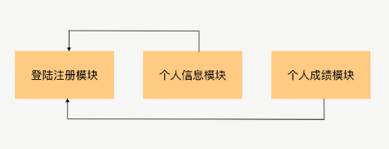
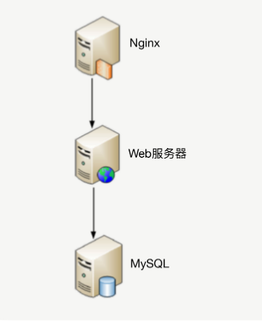
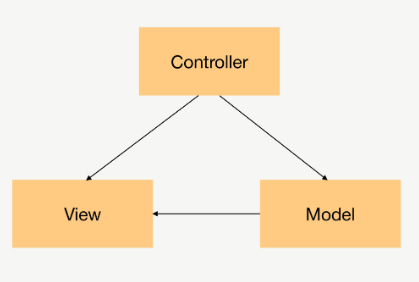

# 架构是什么

**软甲架构指软件系统的顶层结构：**

第一：“系统是一群关联个体组成”，这些“个体”可以是“子系统”、“模块”、“组件”等。架构需要明确包含哪些“个体”。

第二：系统中的个体需要“根据某种规则”运作，架构需要明确个体运作和协作的规则。

例如：以“学生管理系统”为例，
  
从业务逻辑的角度分析，“学生管理系统”的架构是：
  

从物理部署的角度分解，“学生管理系统”的架构是：

从开发规范的角度分解，“学生管理系统”可以采用标准的 MVC 框架来开发，因此架构又变成了 MVC 架构：

# 架构设计的历史背景
软件架构的出现有其历史必然性。20 世纪 60 年代第一次软件危机引出了“结构化编程”，创造了“模块”概念；
20 世纪 80 年代第二次软件危机引出了“面向对象编程”，创造了“对象”概念；到了 20 世纪 90 年代“软件架构”开始流行，创造了“组件”概念。
我们可以看到，“模块”“对象”“组件”本质上都是对达到一定规模的软件进行拆分，差别只是在于随着软件的复杂度不断增加，拆分的粒度越来越粗，拆分的层次越来越高。

# 架构设计的目的
**架构设计的真正目的是为了解决软件系统复杂度带来的问题**

## 复杂度来源之高性能
