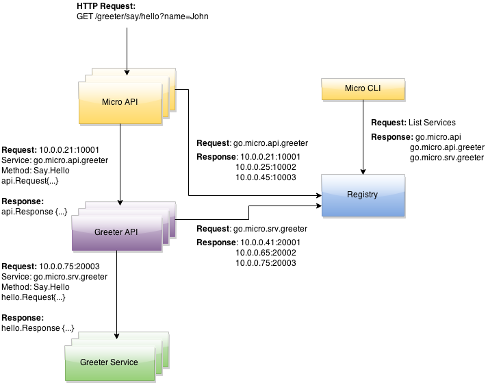

# 了解Micro

​	在Micro中我们构建了一个微服务生态系统，包括用于开发的基本的工具、服务和解决方案。我们已经构建好了基础的工具，这个工具与整个项目同名，也叫[Micro](http://github.com/micro/micro),这一工具让我们更容易构建可扩展的架构，提供效率。

## Go Micro

​	[Go Micro](http://github.com/micro/go-micro) 是一个golang编写的用于构建微服务的插件化的RPC框架。它实现了服务创建、服务发现、服务间通信需要的功能需求。任何优秀的微服务架构都需要解决这三个基础问题：服务发现、同步通信和异步通信。

Go Micro包括以下这些包和功能

- Registry：客户端的服务发现

- Transport：同步通信

- Broker：异步通信

- Selector：节点过滤、负载均衡

- Codec：消息编解码

- Server：基于此库构建RPC服务端

- Client：基于此库构建RPC客户端

  ​	

  ​	Go Micro跟其他工具最大的不同是它是插件化的架构，这让上面每个包的具体实现都可以切换出去。插件化架构的最大好处是你可以选择你喜欢的平台来支撑微服务架构，但无需更改任何底层代码。Go Micro无需任何更改，只需要import你的插件，直接使用即可。

## API

​	服务之间的请求是非常简单直接的，但从外部接入就要复杂一些。具体的服务实例可能会崩溃，重新调度，并监听随机的端口。[API](https://github.com/micro/micro/tree/master/api)这个组件提供了一个接入点，外部的服务可以通过这个API网关向内部的服务发起请求。

## Web UI

​	web UI 提供了一个简单的界面观察运行中的系统，也可以进行一些交互。通过websocket我们可以实时了解运行中系统的情况

## CLI

CLI是一个命令行工具，让我们可以观察、交互和管理运行中的服务，当前的特性允许你查询服务注册，检查服务的健康情况，也可以对服务进行请求

# 架构图

一个全功能的示例，整体的执行过程是这样的：

1. 	HTTP GET请求到API服务，请求地址是：/greeter/say/hello?name=John
2. 	API服务将请求解析并转换成默认的服务形式，服务是go.micro.api.greeter，方法是 Say.Hello
3. 	API使用Go Micro，查询注册器中服务go.micro.api.greeter注册的所有节点，根据负载均衡算法，选择其中一个节点，发出请求
4. 	go.micro.api.greeter服务收到请求，解析到结构体，去注册器查询到go.micro.srv.greeter这个服务，发送请求
5. 	greet server处理完成后，返回相应的内容到greet api
6. 	greet api转换greet服务的响应内容到 api.Response，返回到API服务
7. 	API服务解析请求，返回HTTP请求	

整体的流程如下：

