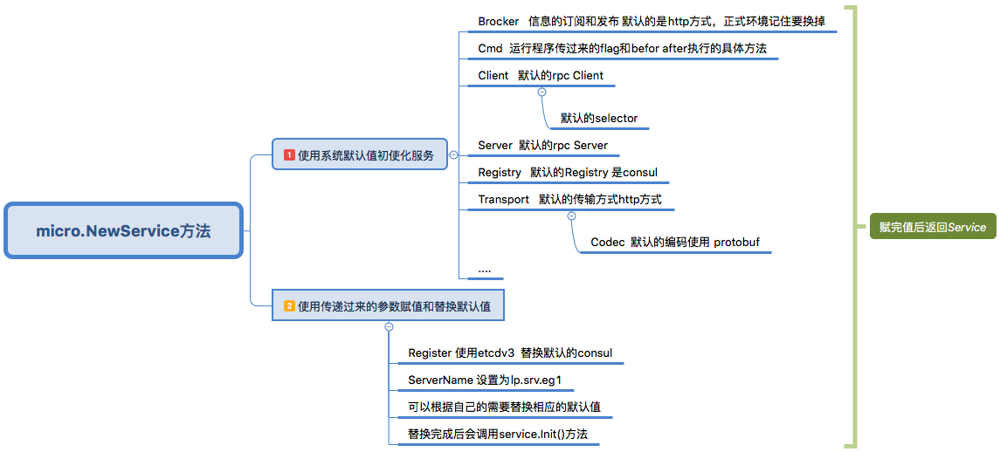
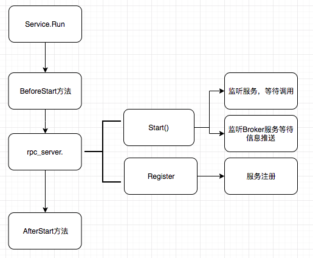

# server 端

## micro.NewService

micro.NewService 初始化服务，然后返回一个Service接口的实例，newService()方法的大概流程如下，

先是给各个接口初始化默认值，再使用传入的值替换默认值，这也是go-micro可替换插件的地方。

## service.Init()

## service.Run()

 service.Run()方法 调用流程：

