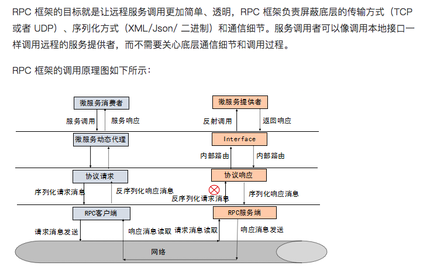
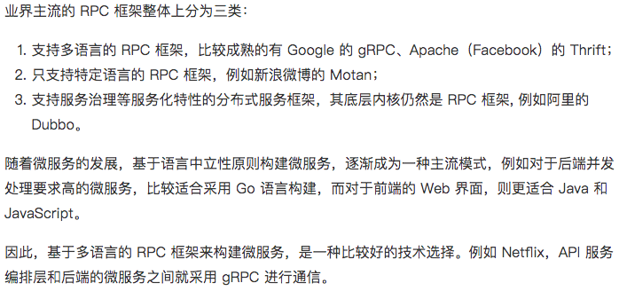
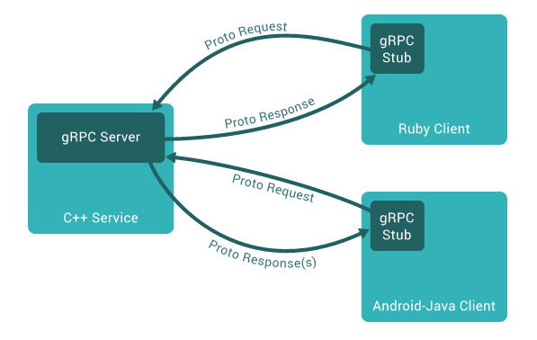
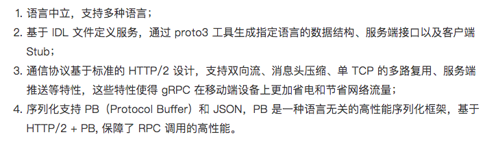

# 一、RPC

## 1. rpc 简介

**RPC(Remote Procedure Call，远程过程调用)**，是一种通过网络从远程计算机程序上请求服务，而不需要了解底层网络细节的应用程序通信协议。RPC采用客户端-服务器端的工作模式，请求程序就是一个客户端，而服务提供程序就是一个服务器端。

远程过程调用总是由客户端对服务器发出一个执行若干过程请求，并用客户端提供的参数。执行结果将返回给客户端。 由于存在各式各样的变体和细节差异，对应地派生了各式远程过程调用协议，而且它们并不互相兼容。

为了允许不同的客户端均能访问服务器，许多标准化的 RPC 系统应运而生了。其中大部分采用接口描述语言（Interface Description Language，IDL），方便跨平台的远程过程调用。



> 1. rpc协议通常包含传输协议和序列化协议。http是传输协议的一中，rpc的传输协议还可以是tcp、udp、http、http/2等；序列化协议包含: 如基于文本编码的 xml json，也有二进制编码的 protobuf hessian等。

## 2. net/rpc

在Go中，标准库提供的net/rpc包实现了RPC协议需要的相关细节，可以很方便的使用该包编写RPC的服务端和客户端程序。

net/rpc包允许PRC客户端程序通过网络或者其他IO连接调用一个远程对象的公开方法(该方法必须是外部可访问即首字母大写)。在PRC服务端，可将一个对象注册为可访问的服务，之后该对象的公开方法就能够以远程的方式提供访问。一个RPC服务端可以注册多个不通类型的对象，但<font color="Brown">不允许注册同一类型的多个对象。</font>

* 一个对象中只有满足如下条件的方法，才能被PRC服务端设置为可供远程访问：

  * <font color="Brown">必须是在对象外部可公开调用的方法(首字母大写)</font>
  * <font color="Brown">必须有两个参数，且参数的类型都必须是包外部可以访问的类型或者是Go內建支持的类型</font> 
  * <font color="Brown">第二个参数必须是一个指针</font> 
  * <font color="Brown">方法必须返回一个error类型的值</font> 

  代码表示为

  ```go
  func (t T*)MethodName(argType T1,replyType *T2)error
  ```

  在上面这行代码中，类型 T T1 T2 默认会使用Go内置的encoding/gob包进行编码和解码 
  该方法的第一个参数表示由PRC客户端传入的参数，第二个参数表示要返回给PRC客户端的结果。该方法最后返回一个error类型

*server.go*

```go
// 示例代码
// 1. 定义传入参数和返回参数的数据结构
package main

import (
	"errors"
	"fmt"
	"net"
	"net/rpc"
	"net/rpc/jsonrpc"
)

const (
	URL = "127.0.0.1:5001"
)

// 由客户端传入的参数类型
type Args struct {
	A, B int
}

// 返回给客户端的结果
type Quotient struct {
	Quo, Rem int
}

// 2. 定义服务对象。对象可以很简单，比如是int，或者interface{}，重要的是输出的方法
// 可以注册多个不同类型的对象，不允许注册一个类型的不同对象
type Arith int

// 3. 实现类型的两个方法
func (t *Arith) Multiply(args *Args, reply *int) error {
	*reply = args.A * args.B
	return nil
}
func (t *Arith) Divide(args *Args, quo *Quotient) error {
	if args.B == 0 {
		return errors.New("divide by zero")
	}
	quo.Quo = args.A / args.B
	quo.Rem = args.A % args.B
	return nil
}
func main() {
	// Arith类型只能注册一个对象-arith
	arith := new(Arith)
	rpc.Register(arith)

	tcpAddr, err := net.ResolveTCPAddr("tcp", URL)
	if err != nil {
		fmt.Println(err)
	}
	listener, err := net.ListenTCP("tcp", tcpAddr)
	fmt.Println("listen ", URL)
	for {
		conn, err := listener.Accept()
		if err != nil {
			continue
		}
		go jsonrpc.ServeConn(conn)
	}

}
```


*client.go*

```go
package main

import (
	"fmt"
	"net/rpc/jsonrpc"
)

const (
	URL = "127.0.0.1:5001"
)

// 由客户端传入的参数类型
type Args struct {
	A, B int
}

// 返回给客户端的结果
type Quotient struct {
	Quo, Rem int
}

// 2. 定义服务对象。对象可以很简单，比如是int，或者interface{}，重要的是输出的方法
// 可以注册多个不同类型的对象，不允许注册一个类型的不同对象
type Arith int


func main() {
	var res int
	client, err := jsonrpc.Dial("tcp", URL)
	if err != nil {
		fmt.Println(err)
	}

	err = client.Call("Arith.Multiply", &Args{10, 20}, &res)
	if err != nil {
		fmt.Println(err)
	}

	fmt.Printf("rpc response:%d\n", res)

}

```


## 3. 主流rpc



# 二、GRPC

## 1. gRPC简介

gRPC是一个高性能、开源、通用的RPC框架， 面向服务端和移动端，基于[HTTP/2](https://http2.github.io/)协议标准设计开发。默认采用Protocol Buffers数据序列化协议([Protocol Buffers基本语法]())，支持多种开发语言。

gRPC 的调用示例如下所示：



## 2. gRPC 的特点



## 2. protocol buffers

gRPC 默认使用 *protocol buffers*，这是 Google 开源的一套成熟的**结构数据序列化机制**

Protobuf 有如 XML，不过它更小、更快、也更简单。你可以定义自己的数据结构，然后使用代码生成器生成的代码来读写这个数据结构。你甚至可以在无需重新部署程序的情况下更新数据结构。只需使用 Protobuf 对数据结构进行一次描述，即可利用各种不同语言或从各种不同数据流中对你的结构化数据轻松读写。

一般情况下，使用 Protobuf 的人们都会先写好 .proto 文件，再用 Protobuf 编译器生成目标语言所需要的源代码文件。将这些生成的代码和应用程序一起编译。


## 3. 开发流程

> 1. 编写.proto描述文件，
>
>    使用 protocol buffers 接口定义语言来定义服务方法，用 protocol buffer 来定义参数和返回类型。客户端和服务端均使用服务定义生成的接口代码。
>
> 2. 编译生成.pb.go文件
>
>    一旦定义好服务，我们可以使用 protocol buffer 编译器 `protoc` 来生成创建应用所需的特定客户端和服务端的代码
>
>    `protoc -I ../protos ../protos/helloworld.proto --go_out=plugins=grpc：helloworld	`
>
> 3. 服务端实现约定的接口并提供服务
>
> 4. 客户端按照约定调用方法请求服务

**1. proto接口描述文件**

```shell
syntax = "proto3";

option java_multiple_files = true;
option java_package = "io.grpc.examples.helloworld";
option java_outer_classname = "HelloWorldProto";

package helloworld;

// The greeting service definition.
service Greeter {
  // Sends a greeting
  rpc SayHello (HelloRequest) returns (HelloReply) {}
}

// The request message containing the user's name.
message HelloRequest {
  string name = 1;
}

// The response message containing the greetings
message HelloReply {
  string message = 1;
}
```

**2. 编译.proto文件**

```shell 
protoc --go_out=plugins=grpc:. helloworld.ptoro
```

**3. server.go**

```go 
package main

import (
	"context"
	"google.golang.org/grpc"
	"log"
	"net"

	pb "google.golang.org/grpc/examples/helloworld/helloworld" //protoc 生成代码
)

const (
	port = ":5001"
)

type server struct {
	pb.UnimplementedGreeterServer
}

func (*server) SayHello(ctx context.Context, in *pb.HelloRequest) (*pb.HelloReply, error) {
	log.Printf("Received: %v", in.GetName())
	return &pb.HelloReply{Message: "Hello " + in.GetName()}, nil

}

func main() {
  // 1. 建立tcp的socket
	lis, err := net.Listen("tcp", port) 

	if err != nil {
		log.Fatalf("failed to listen: %v", err)
	}
  // 2. 开启新的grpc服务
	s := grpc.NewServer()
  // 3. 服务注册
	pb.RegisterGreeterServer(s, &server{})

  // 监听服务
	if err := s.Serve(lis); err != nil {
		log.Fatalf("failed to serve: %v", err)
	}
}

```

 **4. server.go**

```go
package main

import (
	"context"
	"google.golang.org/grpc"
	pb "google.golang.org/grpc/examples/helloworld/helloworld"
	"log"
	"os"
	"time"
)

const (
	address     = "localhost:5001"
	defaultName = "world"
)

func main() {
	// Set up a connection to the server.
	conn, err := grpc.Dial(address, grpc.WithInsecure(), grpc.WithBlock())
	if err != nil {
		log.Fatalf("did not connect: %v", err)
	}
	defer conn.Close()
	c := pb.NewGreeterClient(conn)

	// Contact the server and print out its response.
	name := defaultName
	if len(os.Args) > 1 {
		name = os.Args[1]
	}
	ctx, cancel := context.WithTimeout(context.Background(), time.Second)
	defer cancel()
	r, err := c.SayHello(ctx, &pb.HelloRequest{Name: name})
	if err != nil {
		log.Fatalf("could not greet: %v", err)
	}
	log.Printf("Greeting: %s", r.GetMessage())
}
```

