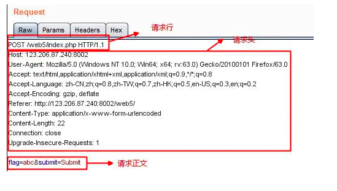
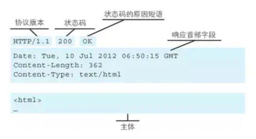

# HTTP知识点整理

## Http的请求报文格式

* 请求行

  请求方法字段、URL字段、HTTP协议版本字段。它们用空格分隔。

* 请求头部

  由关键字/值对组成，每行一对，关键字和值用英文冒号“:”分隔

* 空行

* 请求体

  

## Http响应报文格式

- 响应行

  由协议版本，状态码和状态码的原因短语组成，例如`HTTP/1.1 200 OK`

- 响应头

  响应部首组成

- 空行

- 响应体

  

## Http 常用首部

通用首部字段（General Header Fields）：请求报文和响应报文两方都会使用的首部

- Cache-Control 控制缓存 
- Connection 连接管理、逐条首部 
- Transfor-Encoding 报文主体的传输编码格式 

**request请求**

* Host 请求资源所在服务器 
* User-Agent 客户端程序信息 
* Referer 提供访问来源的信息。
* Authorization web的认证信息 
* Accept 客户端或者代理能够处理的媒体类型 
* Accept-Encoding 优先可处理的编码格式
* Accept-Language 优先可处理的自然语言

**response 响应**

- Location 令客户端重定向的URI 
- Server 服务器的信息 

**实体首部字段**

- Allow 资源可支持http请求的方法 

## Http状态码

**2xx 成功**

* 200 OK，表示从客户端发来的请求在服务器端被正确处理 

**3xx 重定向**

* 302 found，临时性重定向，表示资源临时被分配了新的 URL 

**4xx 客户端错误**

- 403 forbidden，表示对请求资源的访问被服务器拒绝 
- 404 not found，表示在服务器上没有找到请求的资源 

**5xx 服务器错误**

* 500 internal sever error，表示服务器端在执行请求时发生了错误

## Http 的Keep-alive

keep-alive 设计机制：

* 早期的HTTP/1.0中，每次http请求都要创建一个连接，而创建连接的过程需要消耗资源和时间，为了减少资源消耗，缩短响应时间，就需要重用连接。
* HTTP/1.0中以及HTTP/1.1中，如果想要保持长连接，需要在请求头中加上Connection: keep-alive 来告诉对方这个请求响应完成后不要关闭，下一次还用这个请求继续交流
* HTTP 长连接不可能一直保持，例如 `Keep-Alive: timeout=5, max=100`，表示这个TCP通道可以保持5秒，max=100，表示这个长连接最多接收100次请求就断开。

keep-alive的优点：

- 较少的CPU和内存的使用（由于同时打开的连接的减少了）
- 允许请求和应答的HTTP管线化
- 降低拥塞控制 （TCP连接减少了）
- 减少了后续请求的延迟（无需再进行握手）

## GET 和POST有什么区别

* 功能不同：get用于请求服务器发送某些资源；post用于发送数据给服务器
* 数据传输方式不同：GET请求通过URL传输数据，而POST的数据通过请求体传输。
* 数据类型不同：GET只允许 ASCII 字符，而POST无限制

## 跨站攻击

* CSRF（Cross-site request forgery，跨站请求伪造）

  CSRF 攻击要成功的条件在于攻击者能够预测所有的参数从而构造出合法的请求。

  **如何防范跨站请求**

  * Token

    目前主流的做法是使用 Token 抵御 CSRF 攻击。

  * 检测 Referer

    通过检查 `Referer` 的值，我们就可以判断这个请求是合法的还是非法的，但是问题出在服务器不是任何时候都能接受到 `Referer` 的值，所以 Referer Check 一般用于监控 CSRF 攻击的发生，而不用来抵御攻击。

  * 验证码

    CSRF 攻击的过程，往往是在用户不知情的情况下构造网络请求。所以如果使用验证码，那么每次操作都需要用户进行互动，从而简单有效的防御了CSRF攻击。

    但是如果你在一个网站作出任何举动都要输入验证码会严重影响用户体验，所以验证码一般只出现在特殊操作里面，或者在注册时候使用。

* XSS（Cross Site Scripting，跨站脚本攻击）

  XSS 全称“跨站脚本”，是注入攻击的一种。其特点是不对服务器端造成任何伤害，而是通过一些正常的站内交互途径，例如发布评论，提交含有 JavaScript 的内容文本。这时服务器端如果没有过滤或转义掉这些脚本，作为内容发布到了页面上，其他用户访问这个页面的时候就会运行这些脚本。

  

## Http2的特性

### 二进制格式

HTTP/2 采用二进制格式传输数据，而非 HTTP 1.x 的文本格式，二进制协议解析起来更高效。

### 头部压缩（Hpack）

### 多路复用

HTTP 1.x 中，如果想并发多个请求，必须使用多个 TCP 链接，

HTTP2中，同域名下所有通信都在单个连接上完成。