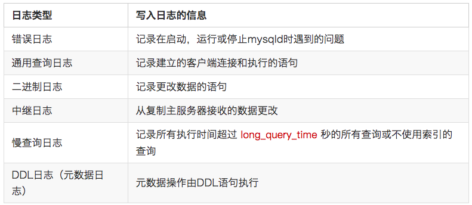

# 《深入浅出MySQL》

## 一、引擎

5.6版本的引擎种类：前四种是常用引擎

### 1. innodb：

事务、外键、行锁、mvcc、聚簇索引、崩溃恢复

* 是事务安全的存储引擎，它具备提交、回滚以及崩溃恢复的功能以保护用户数据。

  > 崩溃恢复的流程：依赖redo log 和undo log

* 支持行锁

  > 表锁和行锁的区别：
  >
  > 在加锁效率、锁定粒度以及冲突概率上，表锁肯定是大于行锁的
  >
  > 但是在并发性能上，表锁远低于行锁。

* 支持MVCC

  > * Multiversion concurrency control 多版本并发控制，**同一份数据临时保留多版本的一种方式，进而实现并发控制**
  >
  > * 并发访问（读或者写）数据库时，对正在事务内处理的数据做多版本的管理，用来避免由于写操作的堵塞，而引发读操作失败的并发问题。
  > *  只在READ COMMITTED 和 REPEATABLE READ 两个隔离级别下工作
  > * MVCC 使用了一种不同的手段，每个连接到数据库的读者，**在某个瞬间看到的是数据库的一个快照**，写者写操作造成的变化在写操作完成之前（或者数据库事务提交之前）对于其他的读者来说是不可见的。
  > * 当一个 MVCC 数据库需要更新一条数据记录的时候，它不会直接用新数据覆盖旧数据，而是将旧数据标记为过时（obsolete）并在别处增加新版本的数据。这样就会有存储多个版本的数据，但是只有一个是最新的。

* 将用户数据存储在聚集索引中以减少基于主键的普通查询所带来的 I/O 开销。

* 为了保证数据的完整性，InnoDB 还支持外键约束。

* InnoDB 写的处理效率差一些并且会占用更多的磁盘空间以保留数据和索引

  >  （ InnoDB中，创建的表的表结构存储在.frm文件中）

### 2. MyISAM：

* 只有表级锁，

* 支持全文索引

* 优势是访问速度非常快。

  > MyISAM的表存储成3个文件。文件的名字与表名相同。拓展名为frm、MYD、MYI。其实，frm文件存储表的结构；MYD文件存储数据，是MYData的缩写；MYI文件存储索引，是MYIndex的缩写。

### 3. MEMORY：

* 曾被称为 HEAP 引擎。在内存中存储所有数据，应用于对非关键数据由快速查找的场景。应用场景正在减少，InnoDB 的内存缓冲区为将大部分或全部数据保持在内存提供了一个通用并耐用的方式。

### 4. Merge：

​		允许 MySql DBA 或开发者将一系列相同的 MyISAM 表进行分组，并把它们作为一个对象进行引用。适用于超大规模数据场景，如数据仓库。

### 5. Archive：

​		黑洞存储引擎，类似于 Unix 的 /dev/null，Archive 只接收但却并不保存数据。对这种引擎的表的查询常常返回一个空集。这种表可以应用于 DML 语句需要发送到从服务器，但主服务器并不会保留这种数据的备份的主从配置中。

### 6. NDB：

​	又叫NDBCLUSTER，集群数据引擎尤其适合于需要最高程度的正常运行时间和可用性的应用。（在标准 MySql 5.6 版本里并不被支持）

## 二、索引

### 1. 索引概述

* **什么是索引**

  索引是对数据库表中一或多个列的值进行排序的结构，是帮助MySQL高效获取数据的数据结构。在数据库中，索引也允许数据库程序迅速地找到表中的数据，而不必扫描整个数据库。

* 索引如何提高查询速度

  将无序的数据变成相对有序的数据（就像查目录一样）

* **按数据结构分**

  * BTree索引：

    Mysql的BTree索引使用的是B树中的B+Tree。但对于主要的两种存储引擎（MyISAM和InnoDB）的实现方式是不同的。

  * HASH索引：
    * 只有MEMORY/Heap引擎支持。
    * HASH索引使用与key-value查询；
    * 不能进行范围查询；只能使用整个关键字查找一行
    * 

  * R-Tree索引（空间索引）：

  * Full-text索引（全文索引）：

* MyISAM和InnoDB实现BTree索引方式的区别

  *  MyISAM: B+Tree叶节点的data域存放的是数据记录的地址。在索引检索的时候，首先按照B+Tree搜索算法搜索索引，如果指定的Key存在，则取出其 data 域的值，然后以 data 域的值为地址读取相应的数据记录。这被称为“非聚簇索引”。
  * InnoDB: 其数据文件本身就是索引文件。相比MyISAM，索引文件和数据文件是分离的，其表数据文件本身就是按B+Tree组织的一个索引结构，树的叶节点data域保存了完整的数据记录。这个索引的key是数据表的主键，因此InnoDB表数据文件本身就是主索引。这被称为“聚簇索引（或聚集索引）”，而其余的索引都作为辅助索引，辅助索引的data域存储相应记录主键的值而不是地址，这也是和MyISAM不同的地方。在根据主索引搜索时，直接找到key所在的节点即可取出数据；在根据辅助索引查找时，则需要先取出主键的值，在走一遍主索引。 因此，在设计表的时候，不建议使用过长的字段作为主键，也不建议使用非单调的字段作为主键，这样会造成主索引频繁分裂。

* 按功能分：

  * 普通索引：最基本的索引，它没有任何限制，
  * 唯一索引：索引列的值必须唯一，但允许有空值（注意和主键不同）
  * 主键索引：它 是一种特殊的唯一索引，不允许有空值。 
  * 全文索引：从CHAR、VARCHAR或TEXT列中作为CREATE TABLE语句的一部分被创建，或是随后使用ALTER TABLE 或CREATE INDEX被添加。// 大容量的数据表，生成全文索引是一个非常消耗时间非常消耗硬盘空间的做法。
  * 单列索引、多列索引：
  * 组合索引（最左前缀）
  * 前缀索引：
  * 覆盖索引：
    * 如果一个索引包含（或者说覆盖）所有需要查询的字段(where,select,ordery by,group by 包含的字段)的值，我们就称之为“覆盖索引”。我们知道在InnoDB存储引擎中，如果不是主键索引，叶子节点存储的是主键+列值。最终还是要“回表”，也就是要通过主键再查找一次。这样就会比较慢覆盖索引就是把要查询出的列和索引是对应的，不做回表
    * 现在创建索引(username,age)，在查询数据的时候：select username , age from user where username = 'Java' and age = 22。要查询出的列在叶子节点都存在！所以，就不用回表。

* 索引特定：

### 2. 如何设计索引

* 在经常需要搜索的列上，可以加快搜索的速度； 
* 在经常使用在WHERE子句中的列上面创建索引，加快条件的判断速度。 
* 在经常需要排序的列上创 建索引，因为索引已经排序，这样查询可以利用索引的排序，加快排序查询时间； 
* 使用唯一索引
* 使用短索引，前缀索引。
* 利用最左前缀
* 不要过度索引，限制每张表的索引数量
  * 当对表中的数据进行增加、删除和修改的时候，索引也要动态的维护，这样就降低了数据的维护速度。
  * 索引需要占物理空间，除了数据表占数据空间之外，每一个索引还要占一定的物理空间，如果要建立聚簇索引，那么需要的空间就会更大。 
  * 创建索引和维护索引要耗费时间，这种时间随着数据量的增加而增加。 

### 2. 索引的优化

​	索引也会有它的缺点：虽然索引大大提高了查询速度，同时却会降低更新表的速度，如对表进行INSERT、UPDATE和DELETE。因为更新表时，MySQL不仅要保存数据，还要保存一下索引文件。有大数据量的表，就需要花时间研究建立最优秀的索引，或优化查询语句：

*  使用前缀索引：

  如果有一个CHAR(255)的列，如果在前10个或20个字符内，多数值是惟一的，那么就不要对整个列进行索引。短索引不仅可以提高查询速度而且可以节省磁盘空间和I/O操作。

* 索引列排序：

  MySQL查询只使用一个索引，因此如果where子句中已经使用了索引的话，那么order by中的列是不会使用索引的。尽量不要包含多个列的排序，如果需要最好给这些列创建复合索引。

* 一般情况下不鼓励使用like操作，因为此操作不会使用索引。但是like “%aaa%” 不会使用索引而like “aaa%”可以使用索引。

* 不要在列上进行运算

  select * from users where YEAR(adddate)<2007，将在每个行上进行运算，这将导致索引失效而进行全表扫描，因此我们可以改成：select * from users where adddate<’2007-01-01′。

  

### 3. 存在索引但是不能引用索引的场景

1. 以%开头的`LIKE`查询不能够利用B-Tree索引

2. 数据类型出现隐式转换的时候也不会使用索引

3. 复合索引下，不满足最左原则时不会使用复合索引

4. 如果mysql估计使用索引比全表扫描更慢，则不使用索引

5. 用or分割开的条件，如果or前的条件中的列有索引，而后面的列没有索引，那么涉及的索引都不会被用到。

6. 字段左边出现了计算：

   > 没有使用索引：
   >
   > select * from t where c - 1 = 1000;
   >
   > 使用索引：
   >
   > select * from t where c = 1000 + 1;

7. 查询的时候，对where字句进行函数操作，也是会导致没有用上索引的

### 4. 注意实项

	* MySQL只对一下操作符才使用索引：<,<=,=,>,>=,between,in,以及某些时候的like(不以通配符%或_开头的情形)。
	* 理论上每张表里面最多可创建16个索引，使用索引查询不一定能提高查询性能,每当有记录在表中增减或索引列被修改时,索引本身也会被修改. 这意味着每条记录的INSERT,DELETE,UPDATE将为此多付出4,5 次的磁盘I/O. 因为索引需要额外的存储空间和处理,那些不必要的索引反而会使查询反应时间变慢.

## 三、视图

### 1. 视图概述

* 视图是一种**虚拟的表**，具有和物理表相同的功能。可以对视图进行增，改，查，操作，试图通常是**有一个表或者多个表的行或列的子集**。对视图的修改不影响基本表。它使得我们获取数据更容易，相比多表查询。
* 并不在数据库中实现存在，行和列数据来自定义视图查询中使用的表，并且在使用视图时动态生成。
* 安全：**只暴露部分字段给访问者**，所以就建一个虚表，就是视图。
* **查询的数据来源于不同的表，而查询者希望以统一的方式查询**，这样也可以建立一个视图，把多个表查询结果联合起来，查询者只需要直接从视图中获取数据

### 2. 视图特点

* 简单:使用视图的用户完全不需要关心后面对应的表的结构、关联条件和筛选条件，**对用户来说已经是过滤好的复合条件的结果集。**
* 安全:使用视图的用户只能访问他们被允许查询的结果集，对表的权限管理并不能限制到某个行某个列，但是通过视图就可以简单的实现。
* 数据独立:一旦视图的结构确定了，可以屏蔽表结构变化对用户的影响，源表增加列对视图没有影响;源表修改列名，则可以通过修改视图来解决，不会造成对访问 者的影响。

### 3. 视图算法

​	MySQL在处理视图时有两种算法，分别称为MERGE和TEMPTABLE。"CREATE VIEW"语句时可以指定使用哪种算法。不显现指定的话，Mysql默认使用Merge算法。

* MERGE，将视图sql合并到主查询sql中，重新构成新sql进行查询。
* TEMPTABLE，就是将视图当作临时表来处理。

视图定义中使用了以下SQL构造块就无法使用MERGE算法：

> 聚集函数
> DISTINCT
> GROUP BY
> HAVING
> 集合操作（UNION, UNION ALL）
> 子查询

## 四. 事务

### 1. **事务概述**

**事务是一组逻辑上的操作，要么都执行，要么都不执行。**要给小红转账1000元，这个转账会涉及到两个关键操作就是：将小明的余额减少1000元，将小红的余额增加1000元。万一在这两个操作之间突然出现错误比如银行系统崩溃，导致小明余额减少而小红的余额没有增加，这样就不对了。事务就是保证这两个关键操作要么都成功，要么都要失败。

### 2. 事物特性（ACID）

* **原子性（Atomicity）**：事务是最小的执行单位，不允许分割。事务的原子性确保动作要么全部完成，要么完全不起作用；
* **一致性（Consistency）：** 执行事务前后，数据保持一致，多个事务对同一个数据读取的结果是相同的；
* **隔离性（Isolation）：** 并发访问数据库时，一个用户的事务不被其他事务所干扰，各并发事务之间数据库是独立的；

* **持久性（Durability）：** 一个事务被提交之后。它对数据库中数据的改变是持久的，即使数据库发生故障也不应该对其有任何影响。

### 3. 并发事务引发的问题

在典型的应用程序中，多个事务并发运行，经常会操作相同的数据来完成各自的任务（多个用户对同一数据进行操作）。并发虽然是必须的，但可能会导致以下的问题：

* **脏读（Dirty Read）：**当一个事务正在访问数据并且对数据进行了修改，而这种修改还没有提交到数据库中，这时另外一个事务也访问了这个数据，然后使用了这个数据。因为这个数据是还没有提交的数据，那么另外一个事务读到的这个数据是“脏数据”，依据“脏数据”所做的操作可能是不正确的。

* **丢失修改（Lost to modify）：**指在一个事务读取一个数据时，另外一个事务也访问了该数据，那么在第一个事务中修改了这个数据后，第二个事务也修改了这个数据。这样第一个事务内的修改结果就被丢失，因此称为丢失修改。 例如：事务1读取某表中的数据A=20，事务2也读取A=20，事务1修改A=A-1，事务2也修改A=A-1，最终结果A=19，事务1的修改被丢失。

* **不可重复读（Unrepeatable read）：**指在一个事务内多次读同一数据。在这个事务还没有结束时，另一个事务也访问该数据。那么，在第一个事务中的两次读数据之间，由于第二个事务的修改导致第一个事务两次读取的数据可能不太一样。
* **幻读（Phantom read）：**幻读与不可重复读类似。它发生在一个事务（T1）读取了几行数据，接着另一个并发事务（T2）插入了一些数据时。在随后的查询中，第一个事务（T1）就会发现多了一些原本不存在的记录，就好像发生了幻觉一样，所以称为幻读

不可重复读的重点是修改比如多次读取一条记录发现其中某些列的值被修改，幻读的重点在于新增或者删除比如多次读取一条记录发现记录增多或减少了。

### 4. 事物隔离级别

- **READ-UNCOMMITTED(读取未提交)：** 最低的隔离级别，允许读取尚未提交的数据变更，**可能会导致脏读、幻读或不可重复读**。
- **READ-COMMITTED(读取已提交)：** 允许读取并发事务已经提交的数据，**可以阻止脏读，但是幻读或不可重复读仍有可能发生**。
- **REPEATABLE-READ(可重复读)：** 对同一字段的多次读取结果都是一致的，除非数据是被本身事务自己所修改，**可以阻止脏读和不可重复读，但幻读仍有可能发生**。
- **SERIALIZABLE(可串行化)：** 最高的隔离级别，完全服从ACID的隔离级别。所有的事务依次逐个执行，这样事务之间就完全不可能产生干扰，也就是说，**该级别可以防止脏读、不可重复读以及幻读**。

 InnoDB 存储引擎的默认支持的隔离级别是 **REPEATABLE-READ（可重读）**

### 5 innodbs 事务实现机制

 InnoDB 引擎通过 redo log 来支持事务的。

## 五、锁机制与innodb锁算法

**MyISAM和InnoDB存储引擎使用的锁：**

- MyISAM采用表级锁(table-level locking)。
- InnoDB支持行级锁(row-level locking)和表级锁,默认为行级锁

**表级锁和行级锁对比：**

- **表级锁：** MySQL中锁定 **粒度最大** 的一种锁，对当前操作的整张表加锁，实现简单，资源消耗也比较少，加锁快，不会出现死锁。其锁定粒度最大，触发锁冲突的概率最高，并发度最低，MyISAM和 InnoDB引擎都支持表级锁。
- **行级锁：** MySQL中锁定 **粒度最小** 的一种锁，只针对当前操作的行进行加锁。 行级锁能大大减少数据库操作的冲突。其加锁粒度最小，并发度高，但加锁的开销也最大，加锁慢，会出现死锁。

**InnoDB存储引擎的锁的算法有三种：**

- Record lock：单个行记录上的锁
- Gap lock：间隙锁，锁定一个范围，不包括记录本身
- Next-key lock：record+gap 锁定一个范围，包含记录本身

# 六、mysql日志

MySQL中一般有以下几种日志：

## 1. binlog

**binlog 简介**

* 二进制日志 binlog 可以说是 MySQL 最重要的日志，它记录了所有的 `DDL` 和 `DML` 语句（除了数据查询语句select、show等），**以事件形式记录**，还包含语句所执行的消耗的时间
* MySQL的二进制日志是事务安全型的
* binlog 的主要目的是**复制和恢复**。

**binlog 使用场景**

​	binlog两个最重要的场景是**主从复制**和**数据恢复**

 * **主从复制**

   MySQL Replication在Master端开启binlog，Master把它的二进制日志传递给slaves来达到master-slave数据一致的目的

* **数据恢复**

  通过使用 mysqlbinlog工具来使恢复数据

# 七、mysql性能优化方案

### 1. 谨慎使用 MySQL 分区表

分区表在物理上表现为多个文件，在逻辑上表现为一个表；

谨慎选择分区键，跨分区查询效率可能更低；

建议采用物理分表的方式管理大数据。

### 2. 尽可能把所有列定义为 NOT NULL

索引 NULL 列需要额外的空间来保存，所以要占用更多的空间

进行比较和计算时要对 NULL 值做特别的处理

### 3. 使用 TIMESTAMP(4 个字节) 或 DATETIME 类型 (8 个字节) 存储时间

TIMESTAMP 存储的时间范围 1970-01-01 00:00:01 ~ 2038-01-19-03:14:07

TIMESTAMP 占用 4 字节和 INT 相同，但比 INT 可读性高

超出 TIMESTAMP 取值范围的使用 DATETIME 类型存储

**经常会有人用字符串存储日期型的数据（不正确的做法）**

缺点 1：无法用日期函数进行计算和比较

缺点 2：用字符串存储日期要占用更多的空间

### 4. 禁止使用 SELECT * 必须使用 SELECT <字段列表> 查询

**原因：**

•消耗更多的 CPU 和 IO 以网络带宽资源

•无法使用覆盖索引

•可减少表结构变更带来的影响

# 七、 问题记录

## 1. 一条SQL语句执行得很慢的原因有哪些？

* **偶尔很慢**

  针对这种情况，这条SQL语句的书写本身是没什么问题的，而是其他原因导致的：

  * *数据库在刷脏页*

    要往数据库插入一条数据、或者要更新一条数据的时候，数据库会在**内存**中把对应字段的数据更新了，但是更新之后，这些更新的字段并不会马上同步持久化到**磁盘**中去，而是把这些更新的记录写入到 redo log 日记中去，等到空闲的时候，在通过 redo log 里的日记把最新的数据同步到**磁盘**中去。

    > 当内存数据页跟磁盘数据页内容不一致的时候，我们称这个内存页为“脏页”。内存数据写入到磁盘后，内存和磁盘上的数据页的内容就一致了，称为“干净页”。

    **redolog写满了：**redo log 里的容量是有限的，如果数据库一直很忙，更新又很频繁，这个时候 redo log 很快就会被写满了，就会导致我们平时正常的SQL语句突然执行的很慢

    **内存不够用了：**如果一次查询较多的数据，恰好碰到所查数据页不在内存中时，需要申请内存，而此时恰好内存不足的时候就需要淘汰一部分内存数据页，如果是干净页，就直接释放，如果恰好是脏页就需要刷脏页。

  * *获取不到锁*

    我们要执行的这条语句，刚好这条语句涉及到的**表**，别人在用，并且加锁了，我们拿不到锁，只能慢慢等待别人释放锁了。

* **一直很慢**

  * *没用到索引*

    * 列上没有建立索引，使用全表扫描查找数据

    * 列上有索引，但是查询时没有使用索引

      （没有使用到索引的情况）

## 2. 一条SQL查询语句在MySQL中如何执行的

> mysql> select * from T where ID = 10;

* MySQL**架构

  * **连接器：** 身份认证和权限相关(登录 MySQL 的时候)

    > 1. mysql -h\$ip -P\$port -u$user -p
    > 2. 连接成功后，可以执行*show processlist*查看连接状态
    > 3. 连接分为长连接和短连接，长连接是每次请求都使用同一个连接。
    > 4. 使用长连接后，mysql占用内存涨的特别快，这是因为mysql在执行过程中临时使用的内存是管理在连接对象里面的，这些资源会在连接断开的时候才会释放

  * **查询缓存:** 执行查询语句的时候，会先查询缓存（MySQL 8.0 版本后移除，因为这个功能不太实用）

  * **分析器:** 没有命中缓存的话，SQL 语句就会经过分析器，分析器说白了就是要先看你的 SQL 语句要干嘛，再检查你的 SQL 语句语法是否正确。先进行“词法分析”，然后进行“语法分析”

  * **优化器：** 按照 MySQL 认为最优的方案去执行。

    > 优化器是在表里有多个索引的时候，决定使用哪个索引；或者在一个语句有多表关联(join)的时候，决定各个表的连接顺序

  * **执行器:** 执行语句，然后从存储引擎返回数据。

    > 1. 开始执行的时候，会先查下对表T有没有执行权限。
    > 2. 执行器打开表的时候，会根据表的引擎定义，去使用这个引擎提供的接口。

  简单来说 MySQL 主要分为 Server 层和存储引擎层：

  > * **Server 层**：主要包括连接器、查询缓存、分析器、优化器、执行器等，所有跨存储引擎的功能都在这一层实现，比如存储过程、触发器、视图，函数等，还有一个通用的日志模块 binglog 日志模块。
  >
  > * **存储引擎**： 主要负责数据的存储和读取，采用可以替换的插件式架构，支持 InnoDB、MyISAM、Memory 等多个存储引擎，其中 InnoDB 引擎有自有的日志模块 redolog 模块。**现在最常用的存储引擎是 InnoDB，它从 MySQL 5.5.5 版本开始就被当做默认存储引擎了。**

  

## 3. 一条SQL更新语句在MySQL中是如何执行的

> mysql>create table T(ID int primary key, c int)
> mysql>update T set c=c+1 where ID=2

首先执行查询语句的那套流程，更新语句也会执行。但与查询流程不一样的是，更新流程还涉及两个重要的日志模块 **redo log**(重做日志)和**binlog(归档日志)**。

>  **redo log**
>
> 1. 使用的是mysql里的WAL技术--Write-Ahead Logging，它的关键点就是先写日志，在写磁盘
> 2. 当有记录需要更新的时候，Innodb引擎会先把记录写到redo log中，并更新内存，此时更新就算完成。innodb会在适当的时候将这个操作记录更新到磁盘中。
> 3. innodb 的redo log是固定大小的，可以从头开始写，写到末尾又回到开头循环写。
> 4. 有了redo log，innodb可以保证即使数据库发生异常重启，之前提交的数据都不会丢失，这个能力叫**crash-safe**
>
> **binlog**
>
> ​	redo log是innodb引擎特有的日志，属于存储层，而server层也有自己日志 ，称为binlog
>
> **redo log 和 binlog 区别**
>
> 1. redo log是innodb所独有的；binlog是MySQL 的server层实现的，所有引擎都可以使用
> 2. redo log是物理日志，记录的是“在某个数据页上做了哪些修改”；binlog是逻辑日志，记录的是这个语句的原始逻辑，比如“给ID = 2的这一行的c字段加1”
> 3. redo log是循环写，空间固定会用完，binlog是追加写。

下图是update语句的流程图，浅色框表示在innodb引擎中执行，深色框表示在执行器中执行。

**两阶段提交**

上图中最后三步，将redo log的写入拆成了两个步骤：prepare 和commit，这就是两阶段提交。

两阶段提交的目的，就是让两份日志之间的逻辑一致，避免从日志恢复出来的数据不一致。

在两阶段提交时，若redo log写入成功，则处于prepare阶段，若binlog写入失败，那么事物本身会回滚。后面再通过binlog恢复出来的库，也会和原先库中数据保持一致。