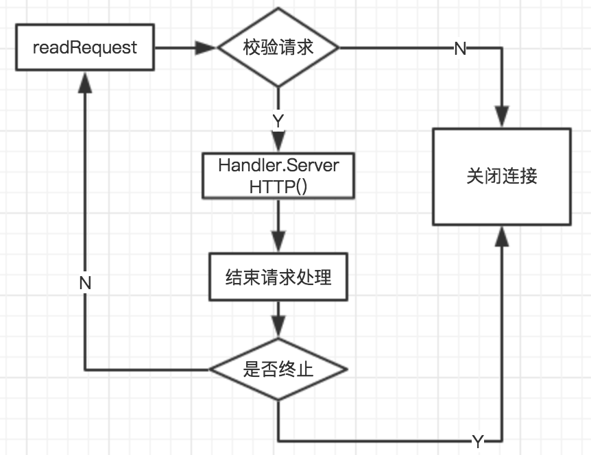
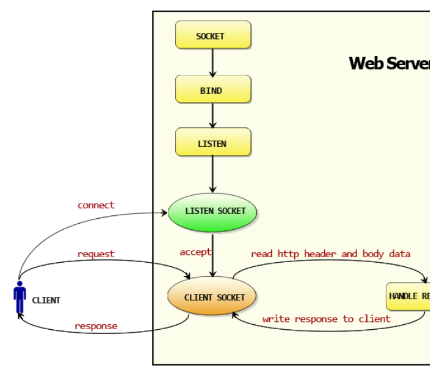
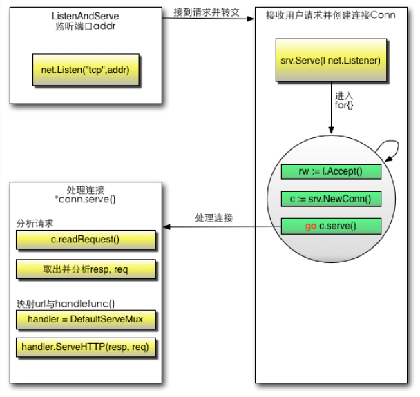

## http服务器示例

http包提供了HTTP客户端和服务端的实现。

```go
//简单的服务端实现
package main
import (
	"io"
	"net/http"
	"log"
)
// hello world, the web server
func HelloServer(w http.ResponseWriter, req *http.Request) {
	io.WriteString(w, "hello, world!\n")
}
func main() {
	http.HandleFunc("/hello", HelloServer)
	err := http.ListenAndServe(":12345", nil)
	if err != nil {
		log.Fatal("ListenAndServe: ", err)
	}
}
```


## func HandleFunc


```go
func HandleFunc(pattern string, handler func(ResponseWriter, *Request))
```

HandleFunc注册一个处理器函数handler和对应的模式pattern（注册到DefaultServeMux）。ServeMux的文档解释了模式的匹配机制。

```go
func HandleFunc(pattern string, handler func(ResponseWriter, *Request)) {
	DefaultServeMux.HandleFunc(pattern, handler)
}

/*...*/

type ServeMux struct {
	mu    sync.RWMutex
	m     map[string]muxEntry
	es    []muxEntry // slice of entries sorted from longest to shortest.
	hosts bool       // whether any patterns contain hostnames
}

type muxEntry struct {
	h       Handler
	pattern string
}

// DefaultServeMux is the default ServeMux used by Serve.
var DefaultServeMux = &defaultServeMux

var defaultServeMux ServeMux //全局变量

/*...*/

// HandleFunc registers the handler function for the given pattern.
func (mux *ServeMux) HandleFunc(pattern string, handler func(ResponseWriter, *Request)) {
	if handler == nil {
		panic("http: nil handler")
	}
	mux.Handle(pattern, HandlerFunc(handler))
}

// Handle registers the handler for the given pattern.
// If a handler already exists for pattern, Handle panics.
func (mux *ServeMux) Handle(pattern string, handler Handler) {
	mux.mu.Lock()
	defer mux.mu.Unlock()

	if pattern == "" {
		panic("http: invalid pattern")
	}
	if handler == nil {
		panic("http: nil handler")
	}
	if _, exist := mux.m[pattern]; exist {
		panic("http: multiple registrations for " + pattern)
	}

	if mux.m == nil {
		mux.m = make(map[string]muxEntry)
	}
	e := muxEntry{h: handler, pattern: pattern}
	mux.m[pattern] = e
	if pattern[len(pattern)-1] == '/' {
		mux.es = appendSorted(mux.es, e)
	}

	if pattern[0] != '/' {
		mux.hosts = true
	}
}
```


## func ListenAndServe

```go
func ListenAndServe(addr string, handler Handler) error
```

该方法用于在指定的TCP 网络地址addr 进行监听，然后调用服务端处理程序来处理传入的连
接请求。该方法有两个参数：第一个参数addr 即监听地址；第二个参数表示服务端处理程序，
通常为空，这意味着服务端调用 http.DefaultServeMux 进行处理，而服务端编写的业务逻辑处理程序 http.Handle() 或 http.HandleFunc() 默认注入 http.DefaultServeMux 中

```go
func ListenAndServe(addr string, handler Handler) error {
	server := &Server{Addr: addr, Handler: handler}
	return server.ListenAndServe()
}

func (srv *Server) ListenAndServe() error {
	if srv.shuttingDown() {
		return ErrServerClosed
	}
	addr := srv.Addr
	if addr == "" {
		addr = ":http"
	}
	ln, err := net.Listen("tcp", addr)
	if err != nil {
		return err
	}
	return srv.Serve(tcpKeepAliveListener{ln.(*net.TCPListener)})
}
```

 在svr.Server()函数中会循环Accept() tcp 连接请求，每当读取到一个tcp conn就启动一个goroutine去处理连接信息， 对于http服务来讲，在goroutine中完成了http request的处理流程如下：



获取到请求信息，接下来就该调用URL对应的具体逻辑了，通过Handler.ServerHTTP()完成了对Handler的调用，主要操作如下：

1. 根据请求信息host,path在serverMux中查找对应的Handler

2. 如果找不到对应Handler，会返回一个NotFoundHandler

3. 调用handler.ServerHttp()

