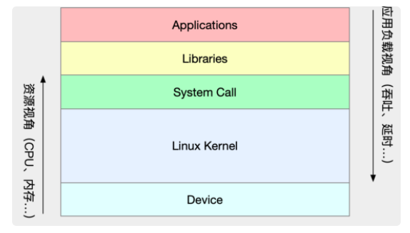

# 学Linux性能优化是在学什么？

 * 常见场景
	* 流量高峰期，服务器 CPU 使用率过高报警，你登录 Linux 上去 top 完之后，却不知道怎么进一步定位，到底是系统 CPU 资源太少，还是程序并发部分写的有问题？
	* 系统并没有跑什么吃内存的程序，但是敲完 free 命令之后，却发现系统已经没有什么内存了，那到底是哪里占用了内存？为什么？
	* 一大早就收到 Zabbix 告警，你发现某台存放监控数据的数据库主机的 iowait 较高，这个时候该怎么办？   
	
* 性能指标是指什么？
	* 从应用负载来看，是：**高并发**，指系统吞吐量；**响应快**：指系统延时
	* 从系统资源的视角来看，则是cpu、内存等
	
	
	
* 性能问题的本质
 	
	**性能问题的本质，就是系统资源已经达到瓶颈，但请求的处理却还不够快，无法支撑更多的请求。**
	
* LInux性能涉及的方面
	* **cpu性能**
	* **磁盘IO性能**
	* **内存性能**
	* **网络性能**

* 学Linux性能优化学的是什么
	* 理解最基本的几个系统知识原理：cpu、磁盘io、内存、网络、文件系统、异步编程等
	* 掌握必要的性能工具

* **Linux性能工具**
	

* **知识大纲**
	