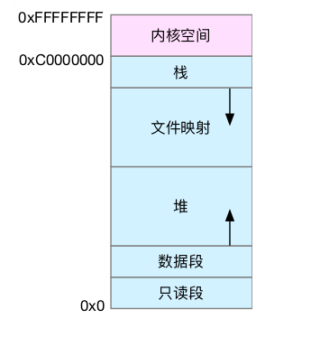

## 虚拟内存原理

* 通常所说的内存容量，就像我刚刚提到的 8GB，其实指的是物理内存。物理内存也称为主存，大多数计算机用的主存都是动态随机访问内存（DRAM）。**只有内核才可以直接访问物理内存。**
* Linux 内核给每个进程都提供了一个独立的虚拟地址空间，并且这个地址空间是连续的。这样，进程就可以很方便地访问内存，更确切地说是访问虚拟内存。

* 虚拟地址空间的内部又被分为内核空间和用户空间两部分，不同字长（也就是单个 CPU 指令可以处理数据的最大长度）的处理器，地址空间的范围也不同。
* 每个进程都有一个这么大的地址空间，那么所有进程的虚拟内存加起来，自然要比实际的物理内存大得多。所以，并不是所有的虚拟内存都会分配物理内存，只有那些实际使用的虚拟内存才分配物理内存，并且分配后的物理内存，是通过内存映射来管理的。

* 内存映射，其实就是将虚拟内存地址映射到物理内存地址。为了完成内存映射，内核为每个进程都维护了一张页表，记录虚拟地址与物理地址的映射关系，

## 虚拟内存分布空间

从图中可以看到，用户空间内存，从低到高分别是五种不同的内存段：

1. 只读段，包括代码和常量等。
2. 数据段，包括全局变量等。
3. 堆，包括动态分配的内存，从低地址开始向上增长。
4. 文件映射段，包括动态库、共享内存等，从高地址开始向下增长。
5. 栈，包括局部变量和函数调用的上下文等。栈的大小是固定的，一般是 8 MB。

## 内存使用情况查看

**free**

free 输出的是一个表格，其中的数值都默认以字节为单位。表格总共有两行六列，这两行分别是物理内存 Mem 和交换分区 Swap 的使用情况，每列数据的含义分别为：

* 第一列，total 是总内存大小；
* 第二列，used 是已使用内存的大小，包含了共享内存；
* 第三列，free 是未使用内存的大小；
* 第四列，shared 是共享内存的大小；
* 第五列，buff/cache 是缓存和缓冲区的大小；
* 第六列，available 是新进程可用内存的大小。

**top**

* **VIRT**：进程虚拟内存的大小，只要是进程申请过的内存，即便还没有真正分配物理内存，也会计算在内。
* **RES**：常驻内存的大小，也就是进程实际使用的物理内存大小，但不包括 Swap 和共享内存。
* **SHR**：共享内存的大小，比如与其他进程共同使用的共享内存、加载的动态链接库以及程序的代码段等。
* **%MEM**：进程使用物理内存占系统总内存的百分比。