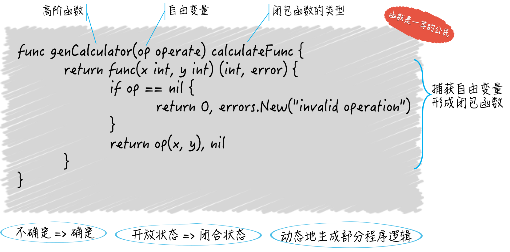

## 函数定义

关键字**func**用于定义函数，函数的主要优点有

- 无需前置声明
- 不支持命名嵌套定义
- 不支持同名函数重载
- 不支持默认参数
- 支持不定长变参
- 支持多返回值
- 支持命名返回值
- 支持匿名函数和闭包

函数是**第一类对象（first-class object）**，具有相同签名（参数及返回值列表）的视作同一类对象

> 第一类对象指可在运行期创建，可用做函数参数或返回值，可存入变量的实体。最常见的用法就是匿名函数。
>
> 函数是第一类对象，意味着函数不光可以用于封装代码，分割功能，解耦逻辑（正常用法），还可以作为普通的值，在其它函数间传递，赋予变量，做类型判断和转换等。
>
> 函数是第一类对象是函数式编程（functional programing）的重要特征。go语言在语言层面上支持了函数式编程。


**函数类型**

```go
//定义函数类型
type FormatFunc func(string, ...interface()) (string, error)
```

函数只能判断其是否为nil，不支持其它比较操作。我们能把**具有相同签名的函数抽象成独立的函数类型**，以作为一组输入、输出（或者说一类逻辑组建）的代表。


## 参数

在参数列表中，相同的同类型参数可合并。

**形参**是指函数定义中的参数，**实参**则是函数调用时所传递的参数。

参数的传递都是**值拷贝传递（pass-by-value）**，区别是拷贝目标对象，还是拷贝指针

**变参**本质上就是一个切片，只能接收一到多个同类型参数，且必须放在参数列表尾部。

将切片作为参数时，需进行展开操作。如果是数组，先将其转换为切片。切片参数修改时，也会修改原数据

```go
func test(a ...int) {
    fmt.Println(a)
}

func main() {
    a := [3]int{1,2,3}
    test(a[:]...)
}
```


## 返回值

有返回值的函数，必须有明确的**return**终止语句。

**命名返回值**

```
func test(s string, index int) (count int, page int, err error) {
    
}
//如果返回值类型能明确表明其含义，就尽量不要对其命名
```

 ## 匿名函数

匿名函数是指没有定义名字符号的函数。匿名函数可直接调用、保存到变量，作为参数或返回值。

普通函数和匿名函数都可作为结构体字段，或经通道传递。

不曾使用的匿名函数会被编译器当做错误。

- 匿名函数没有函数名，只有函数体，经常被用于实现回调函数、闭包等
- 定义格式:

```
  			func (参数列表) (返回参数列表) {
  				//函数体
  			}
  		* 定义匿名函数:
    			(1). 定义时调用匿名函数
    					func (data int) {
    						fmt.Println("hello",data)
    					}(100)
    			(2). 将匿名函数赋值给变量
    				f := func (data string) {
    					fmt.Println(data)
    				}
    			  f("hello golang!!")
```

## 闭包

**闭包（closure）是在其词法上下文中引用了自由变量的函数，或者说是函数和其引用的环境的组合体**

所谓的自由变量，既不代表当前函数的任何参数或结果，也不是函数内部声明的，它是直接从外边拿过来的。

闭包函数就是因为引用了自由变量，而呈现了一种“ 不确定”的状态，也叫“开放”状态。也就是说，它的内部逻辑并不是完整的，有一部分逻辑需要这个自由变量参与完成，而后者到底代表了什么在闭包函数被定义的时候确是未知的。（*我们在定义闭包函数的时候最多也只能知道自由变量的类型*）

```go 
//示例：test返回的匿名函数会引用上下文环境变量x。当该函数在main中执行时，依然可正确读取x的值。
//这种现象就称作闭包。
func test(x int) func() {
    return func() {
        println(x)
    }
}

func main() {
    f := test(123)
    f()
}
```

## 延迟调用

语句**defer**向当前函数注册稍后执行的函数调用。这些调用被称为延迟调用。

延迟调用注册的是调用，必须提供执行所需参数（哪怕为空）。**参数值在注册时被赋值并缓存起来**。如对状态敏感，可改用指针或闭包。


## 错误处理

标准库将**error**定义为接口类型，以便实现自定义错误类型。

按惯例，error总是最后一个返回参数。

**panic/recover**：panic会立即终止当前函数流程，执行延迟调用。而在延迟调用函数中，recover可捕获并返回panic提交的错误对象。注意，recover必须在延迟调用函数中执行才能正常工作。


> 什么是高阶函数：
>
> 1. 接收其它函数作为参数传入；
> 2. 把其它的函数作为结果返回；

