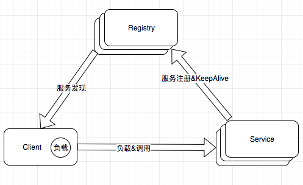
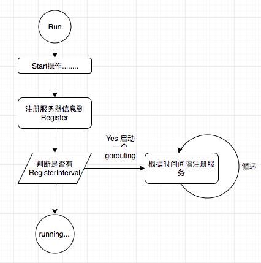

​	服务的注册与发现是微服务必不可少的功能，这样系统才能有更高的性能，更高的可用性。go-micro框架的服务发现有自己能用的接口Registry。只要实现这个接口就可以定制自己的服务注册和发现。

​	服务端把服务的**1. 地址信息保存到Registry**, 然后**2.定时的心跳检查，或者定时的重新注册服务**。**3.客户端监听Registry，最好是把服务信息保存到本地，监听服务的变动，更新缓存**。当调用服务端的接口是时，根据客户端的服务列表和负载算法选择服务端进行通信。



# go-micro 服务端注册服务

## 流程图：



当服务端调用Run()方法时，会调用service.Start()方法。这个除了监听端口，启动服务，还会把服务的ip端口号信息，和所有的公开接口的元数据信息保存到我们选择的Register服务器上去。

 ttl就是注册服务的过期时间，interval就是间隔多久再次注册服务。如果系统崩溃，过期时间也会把服务删除掉。客户端当然也会有相应的判断，

## 代码流程

```go
//1. newService调用newOptions，初始化Options（Registry）
func newOptions(opts ...Option) Options {
}
//2. registry.DefaultRegistry
//全局变量初始化，获取registry实例
DefaultRegistry = NewRegistry()

//3. service 调用Init()方法
func (s *service) Init(opts ...Option) {
	
}
//（4.）注册处理器
//4. init过程完成，执行service的run方法，run方法调用start方法，start方法中，调用server的start方法
// Start starts the default server
func Start() error {
	config := DefaultServer.Options()
	log.Logf("Starting server %s id %s", config.Name, config.Id)
	return DefaultServer.Start()
}

//5. 执行Start方法
func (s *rpcServer) Start() error {
    //1> 端口监听，
    //2> 连接代理，
    //3> 服务注册
    ...
    // announce self to the world
	if err := s.Register(); err != nil {
		log.Log("Server register error: ", err)
	}
    ...
}
//6. service 调用Registry.Register方法进行注册
func (s *rpcServer) Register() error {
    
}

```


# 客户端发现

客户端发现涉及服务选择Selector和服务发现Register两部分

