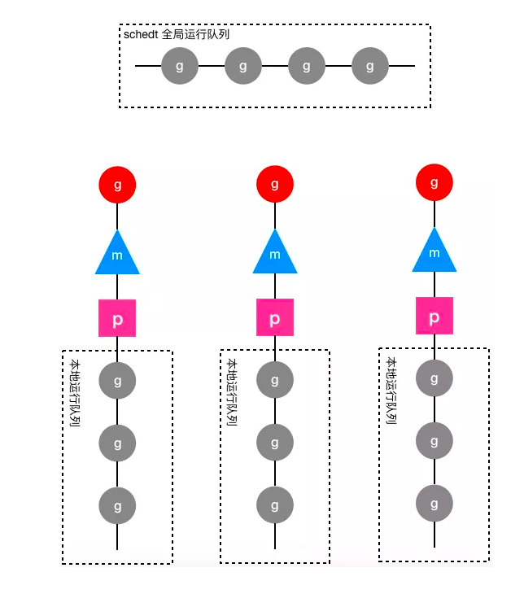

# goroutinue之前：操作系统调度

* go 的调度系统是建立上操作系统线程之上的，为用户空间的调度

* 在C语言中进行多线程编程时，编译时需要链接pthread线程库。创建的用户线程是Linux操作系统内核所支持的线程，它与go语言中的工作线程是一样的，这些线程都由Linux内核负责管理和调度，然后go语言在操作系统线程之上又做了goroutine，实现了一个二级线程模型。

* 操作系统对线程的调度：

  > 1. 操作系统得到cpu的控制权：一般说来在两种情况下会从执行用户程序代码转去执行操作系统代码：
  >
  >    a. 用户程序使用系统调用进入操作系统内核；
  >
  >    b. 硬件中断。硬件中断处理程序由操作系统提供，所以当硬件发生中断时，就会执行操作系统代码。硬件中断有个特别重要的时钟中断，这是操作系统能够发起抢占调度的基础。
  >
  > 2. **操作系统对线程的调度可以简单的理解为内核调度器对不同线程所使用的寄存器和栈的切换。**

* 线程：**操作系统线程是由内核负责调度且拥有自己私有的一组寄存器值和栈的执行流。**

# goroutinue实现：用户层并发

goroutine是Go语言实现的用户态线程，主要用来解决操作系统线程太“重”的问题，主要表现在以下两个方面：

1. **创建和切换太重**：操作系统线程的创建和切换都需要进入内核，而进入内核所消耗的性能代价比较高，开销较大；

2. **内存使用太重：**为了尽量避免极端情况下操作系统线程栈的溢出，内核在创建操作系统线程时默认会为其分配一个较大的栈内存（虚拟地址空间，内核并不会一开始就分配这么多的物理内存），然而在绝大多数情况下，系统线程远远用不了这么多内存，这导致了浪费；而且，栈内存空间一旦创建和初始化完成之后其大小就不能再有变化，这决定了在某些特殊场景下系统线程栈还是有溢出的风险。

   

而相对的，用户态的goroutine则轻量得多：

1. goroutine是用户态线程，其创建和切换都在用户代码中完成而无需进入操作系统内核，其开销要远远小于系统线程的创建和切换；
2. goroutine启动时默认栈大小只有2k，这在多数情况下已经够用了，即使不够用，goroutine的栈也会自动扩大，同时，如果栈太大了过于浪费它还能自动收缩，这样既没有栈溢出的风险，也不会造成栈内存空间的大量浪费。

正是如此，才使得在Go程序中可以轻易的创建成千上万甚至上百万的goroutine出来并发的执行任务而不用太担心性能和内存等问题。

#  goroutinue模型：线程模型

goroutine建立在操作系统线程基础之上，它与操作系统线程之间实现了一个多对多(M:N)的两级线程模型。 M:N 是指M个goroutine运行在N个操作系统线程之上，内核负责对这N个操作系统线程进行调度，而这N个系统线程又负责对这M个goroutine进行调度和运行。

所谓的**对goroutine的调度，是指程序代码按照一定的算法在适当的时候挑选出合适的goroutine并放到CPU上去运行的过程**，这些负责对goroutine进行调度的程序代码我们称之为**goroutine调度器**。

Go的调度器内部有三个重要的结构：线程M，处理器P和goroutinue G，schedt。

1. G — 表示 Goroutine，它是一个待执行的任务；
2. M — 表示操作系统的线程，它由操作系统的调度器调度和管理；
3. P — 表示处理器，它可以被看做运行在线程上的本地调度器；

## **G(Goroutine)**

内核对系统线程的调度简单说来就是：**在执行操作系统代码时，内核调度器按照一定的算法挑选出一个线程并把该线程保存在内存之中的寄存器的值放入CPU对应的寄存器从而恢复该线程的运行。**

同样，系统线程对goroutine的调度与内核对系统线程的调度原理是一样的，实质都是通过**保存和修改CPU寄存器的值来达到切换线程/goroutine的目的。**

**G结构体**保存了goroutine的所有信息，该结构体的每一个实例对象都代表了一个goroutine，调度器代码可以通过g对象来对goroutine进行调度，当goroutine被调离CPU时，调度器代码负责把CPU寄存器的值保存在g对象的成员变量之中，当goroutine被调度起来运行时，调度器代码又负责把g对象的成员变量所保存的寄存器的值恢复到CPU的寄存器。

## schedt(调度器结构体)

**schedt结构体**，一方面用来保存调度器自身的状态信息，另一方面它还拥有一个用来保存goroutine的运行队列。因为每个Go程序只有一个调度器，所以在每个Go程序中schedt结构体只有一个实例对象，该实例对象在源代码中被定义成了一个共享的全局变量，这样每个工作线程都可以访问它以及它所拥有的goroutine运行队列，我们称这个运行队列为**全局运行队列**。

## P（Processor） 

p表示上下文环境。处理器 P 是线程和 Goroutine 的中间层，它能提供线程需要的上下文环境，也会负责调度线程上的等待队列，通过处理器 P 的调度，每一个内核线程都能够执行多个 Goroutine，它能在 Goroutine 进行一些 I/O 操作时及时切换，提高线程的利用率。

**p结构体**的实例对象之中包含着一个局部运行队列**runqueue队列**。因为全局运行队列是每个工作线程都可以读写的，因此访问它需要加锁，但在一个繁忙的系统中，加锁会导致严重的性能问题。于是，调度器又为每个工作线程引入了一个私有的**局部goroutine运行队列**，工作线程优先使用自己的局部运行队列，只有必要时才会去访问全局运行队列，这大大减少了锁冲突，提高了工作线程的并发性。每一个运行着go代码的工作线程（M）都会与一个p结构体的实例对象关联在一起。当一个goroutine执行一个go 语句的时候，goroutine就被添加到runqueue的末端。

## M（Machine）

M 是操作系统线程。调度器最多可以创建 10000 个线程，但是其中大多数的线程都不会执行用户代码（可能陷入系统调用），最多只会有 `GOMAXPROCS` 个活跃线程能够正常运行。

**m结构体**用来代表工作线程（真正干活的人），**数量对应真实的CPU数**。每个工作线程都有唯一的一个m结构体的实例对象与之对应，m结构体对象除了记录着工作线程的诸如栈的起止位置、当前正在执行的goroutine以及是否空闲等等状态信息之外，还通过指针维持着与p结构体的实例对象之间的绑定关系。于是，通过m既可以找到与之对应的工作线程正在运行的goroutine，又可以找到工作线程的局部运行队列等资源。

>表示用于调用的上下文。它是让我们从N：1调度器转到M：N调度器的重要部分。在运行时代码里，它被叫做P，即处理器（processor）
>
>

g、p、m和schedt之间的关系图如下：

* 圆形图案代表g结构体的实例对象，三角形代表m结构体的实例对象，正方形代表p结构体的实例对象，
* 红色的g表示m对应的工作线程正在运行的goroutine，而灰色的g表示处于运行队列之中正在等待被调度起来运行的goroutine。
* 从下图可以看出，每个m都绑定了一个p，每个p都有一个私有的本地goroutine队列，m对应的线程从本地和全局goroutine队列中获取goroutine并运行之。

**工作线程是如何与m结构体一一对应的？工作线程执行的代码是如何找到属于自己的那个m结构体实例对象的呢？**

如果只有一个工作线程，那么就只会有一个m结构体对象，问题就很简单，定义一个全局的m结构体变量就行了。可是我们有多个工作线程和多个m需要一一对应，这时就需要线程本地变量。只要每个工作线程拥有了各自私有的m结构体全局变量，就能在不同的工作线程中使用相同的全局变量名来访问不同的m结构体对象。

具体实现为：每个工作线程在刚刚被创建出来进入调度循环之前就利用线程本地存储机制为该工作线程实现了一个指向m结构体实例对象的私有全局变量，这样在之后的代码中就使用该全局变量来访问自己的m结构体对象以及与m相关联的p和g对象。

# goroutinue：生老病死

* 执行`go`关键字时，最终执行的是runtime.newproc.

* runtime.newproc功能是创建一个新的g.真正的工作是调用newproc1完成的.

* newproc1的动作包括:

  * 分配一个g的结构体

  * 初始化这个结构体的一些域

    > 初始化newg的域时,会将调用参数保存到g的栈;将sp,pc等上下文环境保存在g的sched域.这样当这个g被分配了一个m时就可以运行了.

  * 将g挂在就绪队列

  * 引发一次matchmg

    > matchmg函数目的是做一次匹配。只要m没有突破上限GOMAXPROCS,就拿一个m绑定一个g.如果m的waiting队列中有就从队列中拿,否则就要新建一个m,调用runtime.newm

  * runtime.newm创建M

    > untime.newm功能跟newproc相似,前者分配一个goroutine,而后者是分配一个machine.一个machine就是一个操作系统线程的抽象,它会调用runtime.newosproc.新线程的入口为runtime.mstart

  * 线程中执行调度

    > 新线程的执行和goroutine的执行是两个概念,由于有m这一层对机器的抽象,是m在执行g而不是线程在执行g.所以线程的入口是mstart,g的执行要到schedule才算入口
    >
    > * 找到一个等待运行的g
    > * 将它搬到m->curg,设置好状态为Grunning
    > *  直接切换到g的上下文环境,恢复g的执行

