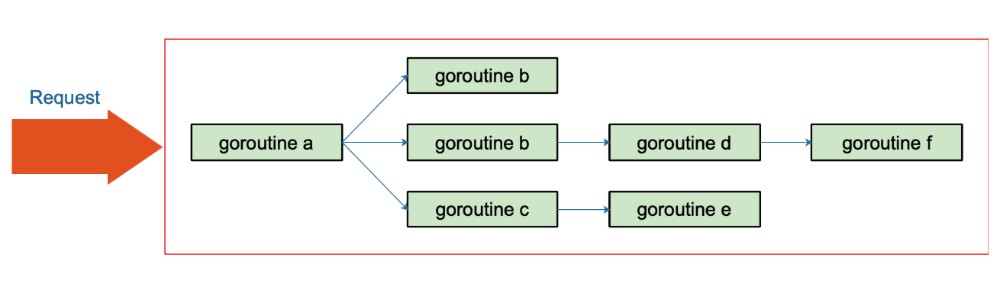
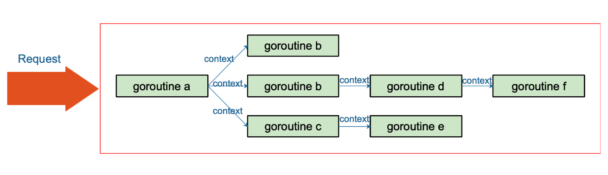

# 一、什么是context

*  Go 1.7 标准库引入 context，中文译作 “上下文”，准确说它是 goroutine 的上下文，包含 goroutine 的运行状态、环境、现场等信息。 

*  context 主要用来在 goroutine 之间传递上下文信息，包括：取消信号、超时时间、截止时间、k-v 等。 

*  **context 几乎成为了并发控制和超时控制的标准做法。** 

* 工作机制：

  > **第一个创建Context的goroutine被称为root节点：root节点负责创建一个实现Context接口的具体对象，并将该对象作为参数传递至新拉起的goroutine作为其上下文。下游goroutine继续封装该对象并以此类推向下传递。 **

# 二、为什么需要context

 在 Go 的 server 里，通常每来一个请求都会启动若干个 goroutine 同时工作：有些去数据库拿数据，有些调用下游接口获取相关数据……  **多个goroutine协调工作涉及通信，同步，通知，退出 四个方面**.




 当请求被取消或是处理时间太长，这有可能是使用者关闭了浏览器或是已经超过了请求方规定的超时时间，请求方直接放弃了这次请求结果。这时，所有正在为这个请求工作的 goroutine 需要快速退出，因为它们的 “工作成果” 不再被需要了。在相关联的 goroutine 都退出后，系统就可以回收相关的资源。  但由于Go之间的goroutine都是平等的，因此当遇到复杂的并发结构时处理退出机制则会显得力不从心。 

context 用来解决 goroutine 之间`退出通知`、`元数据传递`的功能。



# 三、context 使用

1. 创建根节点context

   ctx, cancel := context.WithCancel(context.Context)

2. 将ctx传入goroutine，在goroutine中，使用for - select，监听 `<-ctx.Done()`是否不为`nil`，不为`nil`表示context被取消，继续取消逻辑

3. 根据逻辑调用`cancel`，用来goroutine退出

   ```
   
   ```

   


# 四、源码分析

[**源代码：context.md**](../../src/context/context.go)

## 1. 主要类型以及函数

```go
//  1. 关键接口：
		type Context Interface {
			Deadline() (deadline time.Time, ok bool)
			Done() <-chan struct{}
			Err() errors
			Value(key interface{}) interface{}
		}
//	2. 定义类型，实现接口，声明变量
//		2.1 empty context：不具备任何功能的Context接口，其存在的目的就是作为Context对象树的root节点：
			type emptyCtx int
			func (*emptyCtx) Deadline() (deadline time.Time, ok bool){}
			func (*emptyCtx) Done()
			func (*emptyCtx) Err() errors
			func (*emptyCtx) Value(key interface{}) interface{}
			func (*emptyCtx) String() string {}
//		2.2 WithCancel context：与emptyCtx最大的区别在于，具体实现了cancel函数。即可以向子goroutine传递cancel消息。
			type cancelCtx struct {
				Context
				mu       sync.Mutex
				done     chan struct{}
				children map[canceler]struct{}
				err      error
			}
			// 因为cancelCtx 组合了Context，以下Done、Err、Value为方法重写
			func (*cancelCtx) Done()
			func (*cancelCtx) Err() errors
			func (*cancelCtx) Value(key interface{}) interface{}
			func (*cancelCtx) String() string {}
			func (*cancelCtx) cancel(removeFromParent bool, err error) {}
			// WithCancel函数实现
			func WithCancel(parent Context) (ctx Context, cancel CancelFunc) {

//		2.3. WithDeadline&WithTimeout Context：实现定时退出通知
			type timerCtx struct {
				cancelCtx
				timer *time.Timer // Under cancelCtx.mu.
				deadline time.Time
			}
			func (c *timerCtx) Deadline() (deadline time.Time, ok bool) {}
			func (c *cancelCtx) String() string {}
			// withdaadline 和 timeout 在条件满足时都使用cancel Context的通知方式
			func (c *cancelCtx) cancel(removeFromParent bool, err error) {}
			// 主逻辑
			func WithDeadline(parent Context, d time.Time) (Context, CancelFunc) {}
			func WithTimeout(parent Context, timeout time.Duration) (Context, CancelFunc) {}
//		2.4 value context
			type valueCtx struct {
				Context
				key, val interface{}
			}
			func (c *valueCtx) String() string {}
			func (c *valueCtx) Value(key interface{}) interface{} {
			func WithValue(parent Context, key, val interface{}) Context {}

```

## 2. 两个主要问题

> 两个问题进行代码分析：各Context如何保存父类和子类上下文；以及cancel方法如何实现通知子类context实现退出功能。

1. `emptyCtx`只是一个uint类型的变量，其目的只是为了作为第一个goroutine ctx的parent，因此他不需要，也没法保存子类上下文结构。

2. `cancelctx`中的**`Context`**就是保存父类的context，**`children map[canceler]struct{}`**保存的是所有直属与这个context的子类context，**`done chan struct{}`**用于发送退出信号。**propagateCancel函数的作用是将自己注册至parent context**

   ```go
   func WithCancel(parent Context) (ctx Context, cancel CancelFunc) {
   	c := newCancelCtx(parent)
   	propagateCancel(parent, &c)
   	return &c, func() { c.cancel(true, Canceled) }
   }
   
   // newCancelCtx returns an initialized cancelCtx.
   func newCancelCtx(parent Context) cancelCtx {
   	return cancelCtx{Context: parent}
   }
   
   ```

3. **propagateContxt**

   ```go
   func propagateCancel(parent Context, child canceler) {
     // 1. emptyCtx 无须注册
   	done := parent.Done()
   	if done == nil {
   		return // parent is never canceled
   	}
   
     // 2. 若该contxt已经结束，继续传递给child
   	select {
   	case <-done:
   		// parent is already canceled
   		child.cancel(false, parent.Err())
   		return
   	default:
   	}
   	
     //3. 通过parent寻找最近的一个context，向其注册child
   	if p, ok := parentCancelCtx(parent); ok {
   		p.mu.Lock()
   		if p.err != nil {
   			// parent has already been canceled
   			child.cancel(false, p.err)
   		} else {
   			if p.children == nil {
   				p.children = make(map[canceler]struct{})
   			}
   			p.children[child] = struct{}{}
   		}
   		p.mu.Unlock()
   	} else {
   		atomic.AddInt32(&goroutines, +1)
   		go func() {
   			select {
   			case <-parent.Done():
   				child.cancel(false, parent.Err())
   			case <-child.Done():
   			}
   		}()
   	}
   }
   
   
   func parentCancelCtx(parent Context) (*cancelCtx, bool) {
   	done := parent.Done()
   	if done == closedchan || done == nil {
   		return nil, false
   	}
   	p, ok := parent.Value(&cancelCtxKey).(*cancelCtx)  // 反射，获取动态类型
   	if !ok {
   		return nil, false
   	}
   	p.mu.Lock()
   	ok = p.done == done
   	p.mu.Unlock()
   	if !ok {
   		return nil, false
   	}
   	return p, true
   }
   ```

4. **cancel**

   ```go
   /*
   若外部err为空，则代表这是一个非法的cancel操作，抛出panic；若cancelCtx内部err不为空，说明该Ctx已经执行过cancel操作，直接返回；关闭done channel，关联该Ctx的goroutine收到退出通知；遍历children，若有的话，执行child.cancel操作；调用removeChild将自己从parent context中移除。
   */
   func (c *cancelCtx) cancel(removeFromParent bool, err error) {
   	if err == nil {
   		panic("context: internal error: missing cancel error")
   	}
   	c.mu.Lock()
   	if c.err != nil {
   		c.mu.Unlock()
   		return // already canceled
   	}
   	c.err = err
   	if c.done == nil {
   		c.done = closedchan
   	} else {
   		close(c.done)
   	}
   	for child := range c.children {
   		// NOTE: acquiring the child's lock while holding parent's lock.
   		child.cancel(false, err)
   	}
   	c.children = nil
   	c.mu.Unlock()
   
   	if removeFromParent {
   		removeChild(c.Context, c)
   	}
   }
   ```

   

# 五、参考资料

1.  https://gocn.vip/topics/9366  深度解密Go语言之context
2.  https://mp.weixin.qq.com/s/FJLH4o7Y1TG9I0seiNwR_w // 通过源码分析了Context如何保存父类和子类上下文以及如何通知子类退出

