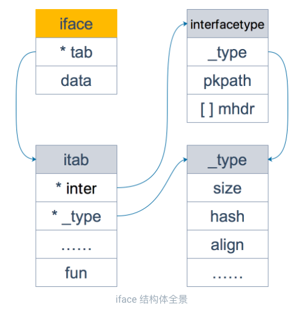

* **什么是接口**

  > * Go 语言中的接口是一种内置的类型，它定义了一组方法的签名。
  > * **接口的本质就是引入一个新的中间层，调用方可以通过接口与具体实现分离，解除上下游的耦合，上层的模块不再需要依赖下层的具体模块，只需要依赖一个约定好的接口。**
  > * 接口还能够帮助我们隐藏底层实现，减少关注点。
  > * 

* 接口的隐式实现

  > 一个类型只要实现了接口中的方法，就说这个类型实现了此接口，不需要显示的声明

* **两种接口**

  > 一种是带有一组方法的接口，另一种是不带任何方法的 `interface{}`。Go 语言使用 `iface` 结构体表示第一种接口，使用 `eface` 结构体表示第二种空接口(由于空结构体在 Go 语言中非常常见，所以在实现时使用了特殊的类型。)

* **结构体、指针和接口**

  > * 当我们使用指针实现接口时，只有指针类型的变量才会实现该接口；当我们使用结构体实现接口时，指针类型和结构体类型都会实现该接口（隐式转换）。
  >
  >   ```go
  >   //作为指针的 &Cat{} 变量能够隐式地获取到指向的结构体，
  >   //所以能在结构体上调用 Walk 和 Quack 方法。
  >   type Cat struct{}
  >   
  >   func (c Cat) Quack() {
  >   	fmt.Println("meow")
  >   }
  >   
  >   func main() {
  >   	var c Duck = &Cat{}
  >   	c.Quack()
  >   }
  >   
  >   // 以下方法编译不过，编译器会提醒我们：Cat 类型没有实现 Duck 接口，Quack 方法的接受者是指针。
  >   type Duck interface {
  >   	Quack()
  >   }
  >   
  >   type Cat struct{}
  >   
  >   // 使用指针实现接口
  >   func (c *Cat) Quack() {
  >   	fmt.Println("meow")
  >   }
  >   
  >   func main() {
  >   	var c Duck = Cat{}
  >   	c.Quack()
  >   }
  >   
  > ```
  >   
  > * 结构体接收者和指针接收者的不同
  >
  >   * 结构指针接收者会在方法内部改变该结构内部变量的值；而结构体接受者在方法内部对变量的改变不会影响该结构
  >   * 避免在每次调用方法时复制该值，在值的类型为大型结构体时，这样做会更加高效。

* **nil != nil**

  > ```go
  > package main
  > 
  > type TestStruct struct{}
  > 
  > func NilOrNot(v interface{}) bool {
  > 	return v == nil
  > }
  > 
  > func main() {
  > 	var s *TestStruct
  > 	fmt.Println(s == nil)      // #=> true
  > 	fmt.Println(NilOrNot(s))   // #=> false
  > }
  > 
  > // $ go run main.go
  > // true
  > //false
  > ```
  >
  > 上述代码的执行结果：
  >
  > - 将上述变量与 `nil` 比较会返回 `true`；
  > - 将上述变量传入 `NilOrNot` 方法并与 `nil` 比较会返回 `false`；
  >
  > 原因：
  >
  > 调用 `NilOrNot` 函数时发生了**隐式的类型转换**，除了向方法传入参数之外，变量的赋值也会触发隐式类型转换。在类型转换时，`*TestStruct` 类型会转换成 `interface{}` 类型，转换后的变量不仅包含转换前的变量，还包含变量的类型信息 `TestStruct`，所以转换后的变量与 `nil` 不相等。
  
* **数据结构**

  > **iface：包含接口的接口**
  >
  > ```go
  > // 包含一组方法的接口类型
  > type iface struct { // 16 bytes
  >   // 接口的类型以及赋给这个接口的实体类型
  > 	tab  *itab
  >   // data 则指向接口具体的值，一般而言是一个指向堆内存的指针。
  > 	data unsafe.Pointer
  > }
  > // itab 结构体是接口类型的核心组成部分，每一个 itab 都占 32 字节的空间，我们可以将其看成接口类型和具体类型的组合，它们分别用 inter 和 _type 两个字段表示：
  > type itab struct {
  >   // 描述了接口的类型
  >     inter  *interfacetype
  >   //描述了实体的类型，包括内存对齐方式，大小等
  >     _type  *_type
  >     link   *itab
  >   //hash 是对 _type.hash 的拷贝，当我们想将 interface 类型转换成具体类型时，可以使用该字段快速判断目标类型和具体类型 _type 是否一致；
  >     hash   uint32 // copy of _type.hash. Used for type switches.
  >     bad    bool   // type does not implement interface
  >     inhash bool   // has this itab been added to hash?
  >     unused [2]byte
  >   //放置和接口方法对应的具体数据类型的方法地址，实现接口调用方法的动态分派
  >     fun    [1]uintptr // variable sized
  > }
  > 
  > type interfacetype struct {
  >     typ     _type
  >     pkgpath name
  >     mhdr    []imethod
  > }
  > ```
  >
  > 

  

  > **eface：空接口类型**
  >
  > 只维护了一个 `_type` 字段，表示空接口所承载的具体的实体类型。`data` 描述了具体的值。
  >
  > ```go
  > type eface struct {
  >     _type *_type
  >     data  unsafe.Pointer
  > }
  > ```

* **类型转换**

  > `指针类型`：
  >
  > 1. 结构体 `Cat` 的初始化；
  > 2. 赋值触发的类型转换过程；
  > 3. 调用接口的方法 `Quack()`；
  >
  > ```go
  > // 指针类型
  > ackage main
  > 
  > type Duck interface {
  > 	Quack()
  > }
  > 
  > type Cat struct {
  > 	Name string
  > }
  > 
  > //go:noinline
  > func (c *Cat) Quack() {
  > 	println(c.Name + " meow")
  > }
  > 
  > func main() {
  > 	var c Duck = &Cat{Name: "grooming"}
  > 	c.Quack()
  > }
  > ```

* **类型断言**

  > 类型断言：将接口类型转换成实际类型
  >
  > ```go
  > //方式一：
  > if instance,ok := 接口对象.(实际类型1);ok{
  > 
  > }else if instance,ok := 接口对象.(实际类型2);ok{
  > 
  > }else if instance,ok := 接口对象.(实际类型3);ok{
  > 
  > }
  > //方式二:
  > switch instance := 接口对象.(type) {
  > case 实际类型1：
  > case 实际类型2：
  > case 实际类型3：
  > }
  > ```
  >