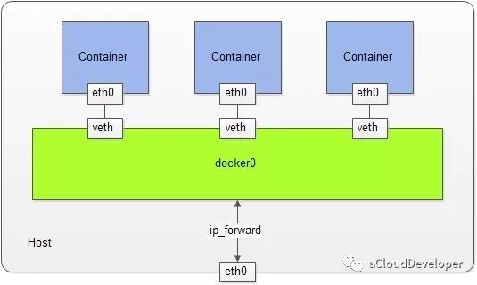
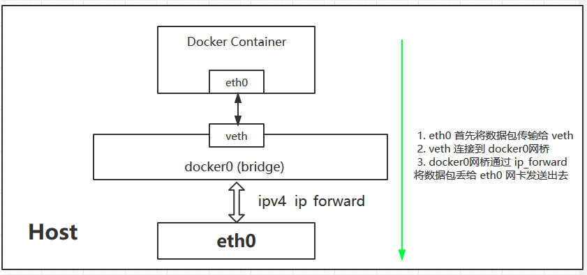

# Docker网络基础

Docker 本身的技术依赖于近年来LInux内核虚拟化技术的发展。因此有必要深入了解Docker背后的网络原理和基础知识。

## 一、Linux网络基础

docker涉及到的主要的网络技术有**网络命名空间（NetWork Namespace）**、**Veth设备对**、**网桥**、**iptables**和路由。

### 1.1 网络命名空间

#### 1.1.1 命名空间

​		Docker 和虚拟机技术一样，从操作系统级上实现了资源的隔离，它本质上是宿主机上的进程（容器进程），所以资源隔离主要就是指进程资源的隔离。实现资源隔离的核心技术就是 Linux namespace。

​		Linux namespace 实现了 6 项资源隔离，基本上涵盖了一个小型操作系统的运行要素，包括主机名、用户权限、文件系统、网络、进程号、进程间通信。

| namespace | 系统调用参数  | 隔离内容                   | 内核版本 |
| --------- | ------------- | -------------------------- | -------- |
| UTS       | CLONE_NEWUTS  | 主机名和域名               | 2.6.19   |
| IPC       | CLONE_NEWIPC  | 信号量、消息队列和共享内存 | 2.6.19   |
| PID       | CLONE_NEWPID  | 进程编号                   | 2.6.24   |
| Network   | CLONE_NEWNET  | 网络设备、网络栈、端口等   | 2.6.29   |
| Mount     | CLONE_NEWNS   | 挂载点（文件系统）         | 2.4.19   |
| User      | CLONE_NEWUSER | 用户和用户组               | 3.8      |

这 6 项资源隔离分别对应 6 种系统调用，通过传入上表中的参数，调用 clone() 函数来完成。

```
clone(int (*child_func)(void *), void *child_stack, int flags, void *arg);
```

#### 1.1.1.2 网络命名空间

​		Network namespace 实现了网络资源的隔离，包括网络设备、IPv4 和 IPv6 协议栈，IP 路由表，防火墙，/proc/net 目录，/sys/class/net 目录，套接字等。

​		Network namespace 不同于其他 namespace 可以独立工作，要使得容器进程和宿主机或其他容器进程之间通信，需要某种“桥梁机制”来连接彼此（并没有真正的隔离），这是通过创建 **veth pair** （虚拟网络设备对，有两端，类似于管道，数据从一端传入能从另一端收到，反之亦然）来实现的。当建立 Network namespace 后，内核会首先建立一个 docker0 网桥，功能类似于 Bridge，用于建立各容器之间和宿主机之间的通信，具体就是分别将 veth pair 的两端分别绑定到 docker0 和新建的 namespace 中。

​		

​		

### 1.2 Veth设备对

​		引入Veth设备对是为了在不同的网络命名空间之间通信， 利用它可以直接将两个网络命名空间连接起来。在Veth设备的一端发送数据时， 它会将数据直接发送到另一端， 并触发另一端的接收操作。  

### 1.3 网桥

​		网桥是一个二层的虚拟网络设备， 把若干个网络接口“连接”起来，读取目标MAC地址的信息， 和自己记录的MAC表结合， 来决策报文的转发目标网络接口。  在转发报文时， 网桥只需要向特定的网口进行转发， 来避免不必要的网络交互。 如果它遇到一个自己从未学习到的地址， 就无法知道这个报文应该向哪个网络接口转发， 就将报文广播给所有的网络接口（报文来源的网络接口除外） 。  

​		但Linux内核支持网口的桥接与单纯的交换机不同，交换机只是一个二层设备， 对于接收到的报文， 要么转发， 要么丢弃。运行着Linux内核的机器本身就是一台主机， 有可能是网络报文的目的地， 其收到的报文除了转发和丢弃， 还可能被送到网络协议栈的上层（网络层） ， 从而被自己（这台主机本身的协议栈） 消化， 所以我们既可以把网桥看作一个二层设备， 也可以把它看作一个三层设备。  

### 1.4 iptables和netfilter

​		在Linux网络协议栈中有一组回调函数挂接点， 通过这些挂接点挂接的钩子函数可以在Linux网络栈处理数据包的过程中对数据包进行一些操作， 例如过滤、 修改、 丢弃等。 整个挂接点技术叫作Netfilter和iptables。  		Netfilter负责在内核中执行各种挂接的规则， 运行在内核模式中；而iptables是在用户模式下运行的进程，负责协助和维护内核中Netfilter的各种规则表。 二者互相配合来实现整个Linux网络协议栈中灵活的数据包处理机制。  

### 1.5 路由

​		Linux系统包含一个完整的路由功能。 当IP层在处理数据发送或者转发时，会使用路由表来决定发往哪里。  如果主机与目的主机直接相连， 那么主机可以直接发送IP报文到目的主机，没有直接相连， 那么主机会将IP报文发送给默认的路由器， 然后由路由器来决定往哪里发送IP报文。     


## 二、Docker网络实现

标准的Docker支持四种网络模式：**host模式**、**container模式**、**none模式**和默认的**bridge模式**。在Kubernetes管理模式下通常只会用到**bridge模式**，所以此处只介绍在bridge模式下Docker是如何支持网络的。流程如下：

1. Docker Daemon 第一次启动时创建docker0网桥。
2. Docker Daemon 利用 veth pair 技术,在宿主机上创建两个虚拟网络接口设备 假设为veth0 和 veth1，而 veth pair 技术的特性可以保证无论哪一个 veth 接收到网络报文,都会将报文传输给另一方。
3. Docker Daemon 将 veth0 附加到  docker0 网桥上，保证宿主机的网络报文可以发往 veth0
4. Docker Daemon 将 veth1 添加到 Docker Container 所属的 namespace 下,并被改名为 eth0

网络逻辑如下图所示：

​	

优势：

　　保证宿主机的网络报文若发往 veth0,则立即会被 eth0 接收，实现宿主机到Docker Container 网络的联通性，同时,也保证 Docker Container 单独使用 eth0，实现容器网络环境的隔离性。

劣势：

　　该模式下 Docker Container 不具有一个公有 IP,即和宿主机的 eth0 不处于同一个网段。导致的结果是宿主机以外的世界不能直接和容器进行通信。虽然 NAT 模式经过中间处理实现了这一点，但是 NAT 模式仍然存在问题与不便,如:容器均需要在宿主机上竞争端口，容器内部服务的访问者需要使用服务发现获知服务的外部端口等。


## 三、docker的网络局限

Docker从一开始就没有考虑到多主机互联的解决方案。在Docker成名之后，重新开始重视网络解决方案。一类是 Docker 在 1.9 版本中引入Libnetwork项目，对跨节点网络的原生支持；一类是通过插件（plugin）方式引入的第三方实现方案，比如 Flannel，Calico 等等。


## 四、参考资料

1. [network namespace 实战操作](https://mp.weixin.qq.com/s/PbHe9OP8EkRwmOYnjPz2uA)

2. [从 VETH 到 Kubernetes 网络通信剖析](https://www.infoq.cn/article/fvRGAt1UUSqUl0P3QULd)

